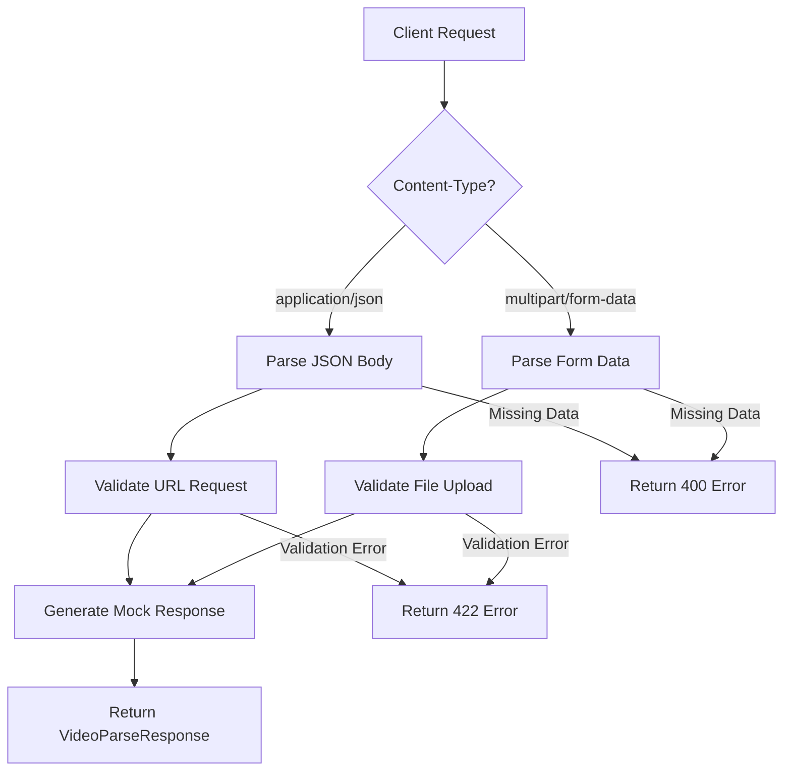

# Design Document

## Overview

This design implements a basic skeleton for the `/api/parse` endpoint that serves as the foundation for the video parsing workflow. The endpoint supports dual input modes (JSON with URLs and multipart form data with file uploads) and returns consistent response structures. This is the first step in building the complete video-to-insights pipeline described in the TOM-326 battle plan.

## Architecture

### High-Level Design

The `/api/parse` endpoint follows a simple request-response pattern with input validation and mock response generation. The design prioritizes:

1. **Input Flexibility**: Support both URL-based and file-based video processing requests
2. **Type Safety**: Use Pydantic models for strict request/response validation  
3. **Error Handling**: Provide clear, consistent error responses
4. **Testability**: Enable comprehensive integration testing

### Request Flow



## Components and Interfaces

### Pydantic Models

#### VideoParseURLRequest
```python
class VideoParseURLRequest(BaseModel):
    url: str
```
- Validates JSON requests containing video URLs
- Ensures URL field is present and is a string

#### AnalysisData  
```python
class AnalysisData(BaseModel):
    transcript: str
    analysis: dict
```
- Represents the core data structure for successful responses
- Contains mock transcript and analysis data

#### VideoParseResponse
```python
class VideoParseResponse(BaseModel):
    success: bool
    data: Optional[AnalysisData] = None
    message: Optional[str] = None
```
- Unified response structure for all endpoint responses
- Follows the API contract defined in the battle plan
- Supports both success and error scenarios

### FastAPI Endpoint

#### Route Definition
```python
@app.post("/api/parse", response_model=VideoParseResponse)
async def parse_video(
    request_data: Optional[VideoParseURLRequest] = None,
    file: Optional[UploadFile] = File(None)
):
```

#### Input Handling Logic
1. **URL Processing**: When `request_data` contains a valid URL, return mock transcript data
2. **File Processing**: When `file` parameter contains an uploaded file, return mock transcript with filename
3. **Error Handling**: When neither input is provided, raise HTTPException with 400 status

### Dependencies

#### python-multipart
- Required for FastAPI to handle multipart/form-data requests
- Must be added to requirements.txt
- Enables file upload functionality

## Data Models

### Request Models

**JSON Request Structure:**
```json
{
  "url": "http://example.com/video.mp4"
}
```

**Multipart Form Data:**
- Field name: `file`
- Content-Type: Determined by uploaded file
- Binary file content

### Response Models

**Success Response:**
```json
{
  "success": true,
  "data": {
    "transcript": "Mock transcript from URL/file",
    "analysis": {}
  }
}
```

**Error Response (handled by FastAPI):**
```json
{
  "detail": "Either URL or file must be provided."
}
```

## Error Handling

### HTTP Status Codes

1. **200 OK**: Successful processing of URL or file request
2. **400 Bad Request**: Neither URL nor file provided
3. **422 Unprocessable Entity**: Pydantic validation failures (malformed JSON, missing fields)

### Error Response Strategy

- Use FastAPI's built-in HTTPException for consistent error handling
- Leverage Pydantic's automatic validation for request structure
- Provide clear error messages for debugging

### Content-Type Validation

FastAPI automatically handles Content-Type validation:
- JSON requests must have `Content-Type: application/json`
- File uploads must have `Content-Type: multipart/form-data`
- Mismatched Content-Type results in 422 status code

## Testing Strategy

### Integration Test Coverage

The testing approach focuses on integration tests that verify the complete request-response cycle:

1. **Successful URL Request Test**
   - Send JSON POST with valid URL
   - Verify 200 status and success response structure

2. **Successful File Upload Test**  
   - Send multipart POST with file data
   - Verify 200 status and filename inclusion in response

3. **Missing Input Error Test**
   - Send empty POST request
   - Verify 400 status code

4. **Content-Type Mismatch Test**
   - Send URL as form data instead of JSON
   - Verify 422 status code for validation error

### Test Client Setup

```python
from fastapi.testclient import TestClient
from .main import app

client = TestClient(app)
```

### Mock Data Strategy

- Use simple string templates for mock transcripts
- Include input identifiers (URL or filename) in mock responses
- Return empty dict for analysis field (to be populated in future iterations)

## Implementation Notes

### Code Organization

The implementation will be added to the existing `apps/coprocessor/app/main.py` file, integrating with the current FastAPI application structure.

### Future Extensibility

This skeleton design provides extension points for:
- Real URL parsing logic (DouyinParser integration)
- Actual file processing workflows
- ASR service integration
- LLM analysis pipeline

### Performance Considerations

- Mock responses ensure fast response times during development
- Async endpoint definition prepares for future async processing
- Minimal memory footprint for basic skeleton functionality