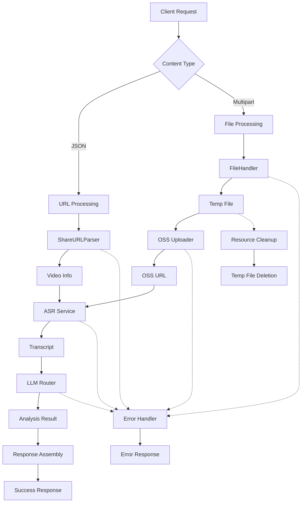
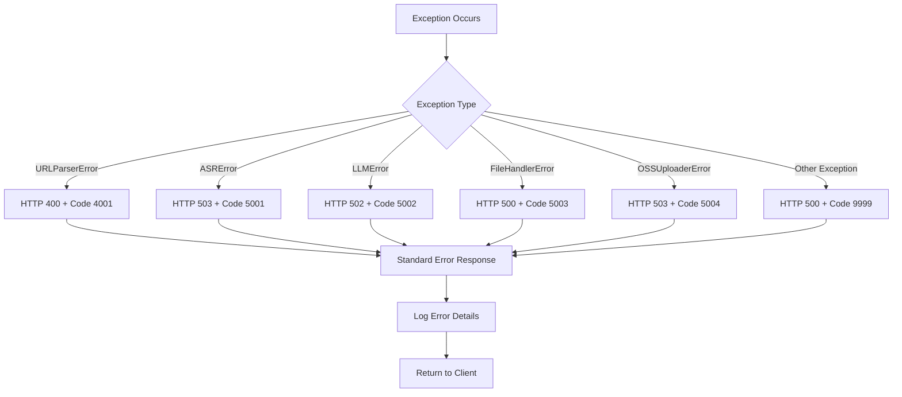

# 端到端工作流和资源清理设计文档

## 概述

本设计文档描述了 `/api/parse` 端点的完整重构方案，实现端到端的视频分析工作流编排，包含标准化的错误处理、资源清理机制和服务集成策略。该设计遵循FastAPI最佳实践和错误处理规范。

## 架构

### 整体工作流架构图



### 错误处理架构



## 组件和接口

### 更新的响应模型

```python
class VideoParseResponse(BaseModel):
    code: int                           # 业务状态码
    success: bool                       # 操作是否成功
    data: Optional[AnalysisData] = None # 成功时的数据
    message: Optional[str] = None       # 错误或成功消息
    processing_time: Optional[float] = None  # 处理时间（秒）
```

### 错误码映射

| HTTP状态码 | 业务错误码 | 异常类型 | 描述 |
|-----------|-----------|----------|------|
| 200 | 0 | - | 成功 |
| 400 | 4001 | URLParserError | URL解析失败 |
| 422 | 4002 | ValidationError | 请求格式错误 |
| 502 | 5002 | LLMError | LLM服务错误 |
| 503 | 5001 | ASRError | ASR服务不可用 |
| 503 | 5004 | OSSUploaderError | OSS服务不可用 |
| 500 | 5003 | FileHandlerError | 文件处理错误 |
| 500 | 9999 | Exception | 未知内部错误 |

### 服务编排接口

```python
class WorkflowOrchestrator:
    """工作流编排器"""
    
    async def process_url_workflow(self, url: str) -> AnalysisData:
        """处理URL工作流"""
        
    async def process_file_workflow(self, file_info: TempFileInfo) -> AnalysisData:
        """处理文件工作流"""
        
    async def cleanup_resources(self, file_info: Optional[TempFileInfo]):
        """清理资源"""
```

## 数据模型

### 请求处理流程

1. **URL处理流程**:
   ```
   JSON Request → URL Validation → ShareURLParser → Video Info → ASR Service → LLM Analysis → Response
   ```

2. **文件处理流程**:
   ```
   Multipart Request → File Validation → FileHandler → OSS Upload → ASR Service → LLM Analysis → Response → Cleanup
   ```

### 成功响应格式

```json
{
  "code": 0,
  "success": true,
  "data": {
    "transcript": "完整的转录文本...",
    "analysis": {
      "video_info": {
        "video_id": "video123",
        "platform": "douyin",
        "title": "视频标题",
        "download_url": "https://..."
      },
      "llm_analysis": {
        "hook": "吸引人的开头",
        "core": "核心内容",
        "cta": "行动号召"
      }
    }
  },
  "message": "Processing completed successfully",
  "processing_time": 45.67
}
```

### 错误响应格式

```json
{
  "code": 5001,
  "success": false,
  "data": null,
  "message": "ASR service is temporarily unavailable",
  "processing_time": 12.34
}
```

## 错误处理

### 异常处理策略

1. **分层异常处理**:
   - 服务层：抛出具体的服务异常
   - 编排层：捕获并转换为HTTP异常
   - 框架层：统一格式化错误响应

2. **错误信息安全**:
   - 对外错误信息通用化，不泄露内部实现细节
   - 详细错误信息记录到日志中
   - 敏感信息（如API密钥）不出现在错误信息中

3. **错误恢复机制**:
   - LLM服务支持主备切换
   - ASR服务失败时提供降级处理
   - 网络错误时进行重试

### 资源清理机制

```python
async def parse_video(...):
    temp_file_info: Optional[TempFileInfo] = None
    start_time = time.time()
    
    try:
        # 主要处理逻辑
        if file_upload:
            temp_file_info = await file_handler.save_upload_file(file)
            # ... 处理逻辑
        
        # 成功响应
        return VideoParseResponse(
            code=0,
            success=True,
            data=result_data,
            processing_time=time.time() - start_time
        )
        
    except URLParserError as e:
        raise HTTPException(
            status_code=400,
            detail={
                "code": 4001,
                "success": False,
                "message": "Failed to parse video URL",
                "processing_time": time.time() - start_time
            }
        )
    # ... 其他异常处理
    
    finally:
        # 确保资源清理
        if temp_file_info:
            await FileHandler.cleanup(temp_file_info.file_path)
```

## 测试策略

### 集成测试覆盖

1. **成功场景测试**:
   - URL工作流成功完成
   - 文件上传工作流成功完成
   - 响应格式正确性验证

2. **错误场景测试**:
   - 各种服务异常的错误处理
   - 资源清理机制验证
   - 错误响应格式验证

3. **边界条件测试**:
   - 大文件上传处理
   - 网络超时处理
   - 并发请求处理

### Mock策略

```python
# 测试中的Mock策略
@pytest.fixture
def mock_services(mocker):
    return {
        'url_parser': mocker.patch('app.services.url_parser.ShareURLParser'),
        'asr_service': mocker.patch('app.services.asr_service.ASRService'),
        'llm_router': mocker.patch('app.services.llm_service.create_llm_router_from_env'),
        'file_handler': mocker.patch('app.services.file_handler.FileHandler'),
        'oss_uploader': mocker.patch('app.services.oss_uploader.create_oss_uploader_from_env')
    }
```

## 性能考虑

### 处理时间目标

- **总体目标**: 1分钟视频 ≤ 50秒处理时间
- **URL解析**: ≤ 2秒
- **文件上传**: ≤ 5秒
- **ASR转录**: ≤ 30秒
- **LLM分析**: ≤ 15秒
- **响应组装**: ≤ 1秒

### 优化策略

1. **并发处理**: 在可能的情况下并行执行独立的操作
2. **连接复用**: 复用HTTP连接以减少网络开销
3. **内存管理**: 及时释放大文件的内存占用
4. **缓存策略**: 对重复的URL解析结果进行缓存

## 安全考虑

### 输入验证

1. **文件类型验证**: 限制上传文件的类型和大小
2. **URL验证**: 验证URL格式和域名白名单
3. **内容过滤**: 基本的内容安全检查

### 错误信息安全

1. **信息脱敏**: 错误信息中不包含敏感数据
2. **日志安全**: 详细错误信息仅记录在服务器日志中
3. **异常处理**: 防止异常信息泄露系统内部结构

## 监控和日志

### 关键指标监控

1. **性能指标**:
   - 请求处理时间
   - 各服务调用耗时
   - 成功率和错误率

2. **业务指标**:
   - 不同错误类型的分布
   - 文件上传vs URL请求的比例
   - 服务故障切换频率

### 日志记录策略

```python
import logging
import time

logger = logging.getLogger(__name__)

async def parse_video(...):
    request_id = generate_request_id()
    start_time = time.time()
    
    logger.info(f"[{request_id}] Starting video parse request")
    
    try:
        # 处理逻辑
        logger.info(f"[{request_id}] ASR completed in {asr_time:.2f}s")
        logger.info(f"[{request_id}] LLM analysis completed in {llm_time:.2f}s")
        
    except Exception as e:
        logger.error(f"[{request_id}] Request failed: {str(e)}", exc_info=True)
        
    finally:
        total_time = time.time() - start_time
        logger.info(f"[{request_id}] Request completed in {total_time:.2f}s")
```

## 扩展性设计

### 新增服务集成

1. **服务接口标准化**: 新服务遵循统一的接口规范
2. **配置化集成**: 通过配置文件控制服务的启用和参数
3. **插件化架构**: 支持动态加载新的处理模块

### 工作流扩展

1. **步骤可配置**: 支持通过配置调整工作流步骤
2. **条件分支**: 支持基于条件的工作流分支
3. **并行处理**: 支持独立步骤的并行执行