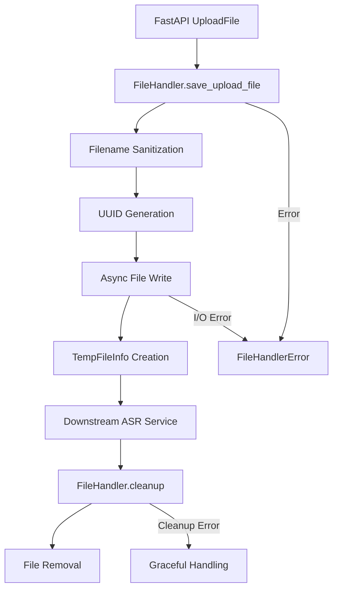

# Design Document

## Overview

This design implements a temporary file handling service that provides secure, async file upload processing for the coprocessor application. The FileHandler service acts as a bridge between FastAPI's UploadFile objects and downstream services that require file paths, ensuring security, uniqueness, and proper cleanup.

## Architecture

### High-Level Design

The FileHandler service follows a service-oriented architecture with clear separation of concerns:

1. **FileHandler**: Main service class that orchestrates file operations
2. **TempFileInfo**: Data model representing saved file information
3. **FileHandlerError**: Custom exception for error handling
4. **Async I/O**: Uses aiofiles for non-blocking file operations
5. **Security**: Implements filename sanitization and path validation

### Component Interaction



## Components and Interfaces

### FileHandler Class

#### Core Methods
```python
class FileHandler:
    def __init__(self, temp_dir: Path = TEMP_DIR):
        """Initialize with configurable temporary directory"""
        
    async def save_upload_file(self, file: UploadFile) -> TempFileInfo:
        """
        Save uploaded file to temporary storage
        
        Args:
            file: FastAPI UploadFile object
            
        Returns:
            TempFileInfo: Information about saved file
            
        Raises:
            FileHandlerError: When file operations fail
        """
        
    @staticmethod
    async def cleanup(file_path: Path) -> None:
        """
        Remove temporary file
        
        Args:
            file_path: Path to file to remove
            
        Note:
            Handles errors gracefully without raising exceptions
        """
```

#### Security Features
- **Filename Sanitization**: Uses `werkzeug.utils.secure_filename`
- **Unique Naming**: Uses UUID4 for collision-free filenames
- **Path Validation**: Prevents directory traversal attacks
- **Permission Control**: Ensures proper file and directory permissions

### Data Models

#### TempFileInfo Model
```python
class TempFileInfo(BaseModel):
    file_path: Path          # Absolute path to saved file
    original_filename: str   # Original uploaded filename (sanitized)
    size: int               # File size in bytes
```

#### FileHandlerError Exception
```python
class FileHandlerError(Exception):
    """Custom exception for file handling errors"""
    def __init__(self, message: str):
        self.message = message
        super().__init__(self.message)
```

### File Processing Workflow

#### Save Operation Flow
1. **Input Validation**: Validate UploadFile object
2. **Filename Processing**: 
   - Extract original filename
   - Apply `secure_filename()` sanitization
   - Generate UUID-based unique filename
3. **Directory Setup**: Ensure temporary directory exists
4. **Async File Write**: Use `aiofiles` for non-blocking I/O
5. **Metadata Collection**: Gather file size and path information
6. **Return Result**: Create and return TempFileInfo object

#### Cleanup Operation Flow
1. **Path Validation**: Verify file path exists
2. **File Removal**: Use `Path.unlink()` to remove file
3. **Error Handling**: Log errors but don't raise exceptions
4. **Graceful Degradation**: Continue operation even if cleanup fails

## Data Models

### File Storage Structure

```
/tmp/scriptparser/
├── {uuid4}-{sanitized_filename}.ext
├── {uuid4}-{sanitized_filename}.ext
└── ...
```

### Filename Generation Strategy

```python
def generate_unique_filename(original_filename: str) -> str:
    """Generate unique filename with UUID prefix"""
    safe_name = secure_filename(original_filename)
    unique_id = str(uuid.uuid4())
    return f"{unique_id}-{safe_name}"
```

## Error Handling

### Error Categories

1. **I/O Errors**
   - Disk full conditions
   - Permission denied errors
   - Network storage failures

2. **Validation Errors**
   - Invalid file objects
   - Malicious filename attempts
   - Unsupported file types

3. **System Errors**
   - Directory creation failures
   - Path resolution issues
   - Resource exhaustion

### Error Response Strategy

```python
try:
    temp_file_info = await file_handler.save_upload_file(file)
    # Process file...
except FileHandlerError as e:
    raise HTTPException(status_code=500, detail=f"File handling failed: {e.message}")
finally:
    if 'temp_file_info' in locals():
        await FileHandler.cleanup(temp_file_info.file_path)
```

## Testing Strategy

### Unit Testing Approach

The testing strategy emphasizes isolated unit tests with comprehensive mocking:

#### Test Categories

1. **Successful Operations**
   - Mock aiofiles operations
   - Verify TempFileInfo creation
   - Test filename sanitization

2. **Error Handling**
   - Mock I/O failures
   - Test permission errors
   - Verify error message clarity

3. **Security Tests**
   - Test malicious filename handling
   - Verify path traversal prevention
   - Test UUID uniqueness

4. **Cleanup Tests**
   - Mock file removal operations
   - Test graceful error handling
   - Verify cleanup in finally blocks

#### Mocking Strategy

```python
@pytest.fixture
def mock_aiofiles(mocker):
    """Mock aiofiles operations"""
    mock_open = mocker.patch('aiofiles.open')
    mock_file = AsyncMock()
    mock_open.return_value.__aenter__.return_value = mock_file
    return mock_file

@pytest.fixture
def mock_upload_file():
    """Create mock UploadFile object"""
    mock_file = Mock(spec=UploadFile)
    mock_file.filename = "test_video.mp4"
    mock_file.size = 1024
    mock_file.read = AsyncMock(return_value=b"mock_content")
    return mock_file
```

## Implementation Details

### Async File Operations

```python
async def save_upload_file(self, file: UploadFile) -> TempFileInfo:
    try:
        # Generate unique filename
        safe_filename = secure_filename(file.filename or "unknown")
        unique_filename = f"{uuid.uuid4()}-{safe_filename}"
        file_path = self.temp_dir / unique_filename
        
        # Write file asynchronously
        async with aiofiles.open(file_path, 'wb') as f:
            content = await file.read()
            await f.write(content)
        
        # Get file size
        file_size = file_path.stat().st_size
        
        return TempFileInfo(
            file_path=file_path,
            original_filename=safe_filename,
            size=file_size
        )
    except Exception as e:
        raise FileHandlerError(f"Failed to save uploaded file: {str(e)}")
```

### Security Considerations

#### Filename Sanitization
- Remove path separators and special characters
- Limit filename length
- Prevent hidden file creation
- Handle Unicode normalization

#### Directory Security
- Use restrictive permissions (700)
- Validate directory paths
- Prevent symlink attacks
- Implement size quotas

### Performance Considerations

#### Async Operations
- Use `aiofiles` for all file I/O
- Implement streaming for large files
- Avoid blocking the event loop
- Handle backpressure appropriately

#### Memory Management
- Stream file content instead of loading entirely
- Clean up resources promptly
- Implement file size limits
- Monitor temporary directory usage

## Integration Points

### API Endpoint Integration

```python
@app.post("/api/parse", response_model=VideoParseResponse)
async def parse_video(
    request: Request,
    url: str | None = Form(None),
    file: UploadFile | None = File(None),
):
    # Handle multipart form data with file upload
    elif "multipart/form-data" in content_type:
        if file:
            file_handler = FileHandler()
            temp_file_info = None
            try:
                # Save uploaded file
                temp_file_info = await file_handler.save_upload_file(file)
                
                # Process file (ASR, etc.)
                # ... processing logic ...
                
                return VideoParseResponse(
                    success=True,
                    data=AnalysisData(
                        transcript=f"Processed file: {temp_file_info.original_filename}",
                        analysis={"file_info": temp_file_info.dict()}
                    )
                )
            except FileHandlerError as e:
                raise HTTPException(status_code=500, detail=str(e))
            finally:
                # Always cleanup temporary file
                if temp_file_info:
                    await FileHandler.cleanup(temp_file_info.file_path)
```

### Dependency Management

New dependencies to be added to `requirements.txt`:
- `aiofiles>=23.2.0` - for async file operations
- `Werkzeug>=2.3.0` - for secure filename handling

## Configuration

### Environment Variables

```python
# Default configuration
TEMP_DIR = Path("/tmp/scriptparser")
MAX_FILE_SIZE = 100 * 1024 * 1024  # 100MB
ALLOWED_EXTENSIONS = {'.mp4', '.avi', '.mov', '.mkv', '.mp3', '.wav'}
```

### Directory Structure

```python
def setup_temp_directory(temp_dir: Path) -> None:
    """Setup temporary directory with proper permissions"""
    temp_dir.mkdir(parents=True, exist_ok=True, mode=0o700)
```