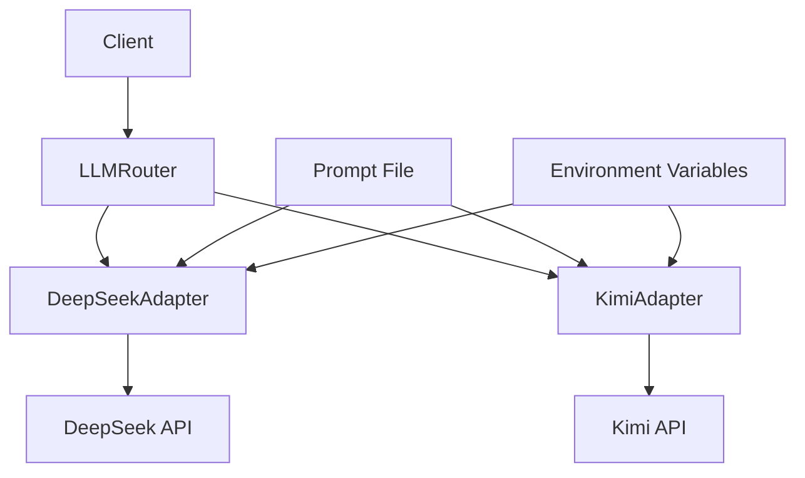

# LLM服务适配器模式设计文档

## 概述

LLM服务适配器模式是一个高可用的LLM服务集成解决方案，支持多个LLM提供商（DeepSeek和Kimi），具备自动故障切换功能，并实现了Prompt与代码的分离。该设计遵循适配器模式和路由器模式，确保系统的可扩展性和可维护性。

## 架构

### 整体架构图



### 核心组件

1. **LLMService协议**: 定义统一的LLM服务接口
2. **适配器层**: DeepSeekAdapter和KimiAdapter实现具体的API调用
3. **路由器层**: LLMRouter实现主备切换逻辑
4. **数据模型**: AnalysisResult定义标准化的返回格式
5. **配置管理**: 外部Prompt文件和环境变量配置

## 组件和接口

### LLMService协议

```python
class LLMService(Protocol):
    async def analyze(self, text: str) -> AnalysisResult:
        """分析文本并返回结构化结果"""
        ...
```

### AnalysisResult数据模型

```python
class AnalysisResult(BaseModel):
    hook: str    # 吸引注意力的开头部分
    core: str    # 核心内容摘要
    cta: str     # 行动号召部分
```

### DeepSeekAdapter适配器

- **职责**: 封装DeepSeek API调用逻辑
- **配置**: 通过DEEPSEEK_API_KEY环境变量获取认证信息
- **错误处理**: 将API错误转换为统一的LLMError异常

### KimiAdapter适配器

- **职责**: 封装Kimi API调用逻辑
- **配置**: 通过KIMI_API_KEY环境变量获取认证信息
- **错误处理**: 将API错误转换为统一的LLMError异常

### LLMRouter路由器

- **职责**: 实现主备服务的自动切换
- **策略**: 优先使用主服务，失败时自动切换到备用服务
- **错误处理**: 当所有服务都失败时抛出LLMError

## 数据模型

### 输入数据

- **text**: 待分析的文本内容（字符串）

### 输出数据

```json
{
  "hook": "吸引注意力的开头1-3句话",
  "core": "核心内容的主要要点摘要",
  "cta": "最后的行动号召句子"
}
```

### 错误响应

- **LLMError**: 统一的LLM服务异常类型
- **错误信息**: 包含详细的错误描述和原因

## 错误处理

### 错误类型

1. **配置错误**: API密钥未设置或无效
2. **网络错误**: HTTP请求失败或超时
3. **API错误**: LLM服务返回错误状态码
4. **解析错误**: 响应格式无效或缺少必需字段
5. **系统错误**: 文件读取失败或其他系统级错误

### 错误处理策略

1. **即时失败**: 配置错误立即抛出异常
2. **自动重试**: 网络错误通过故障切换实现重试
3. **优雅降级**: 单个服务失败时切换到备用服务
4. **详细日志**: 所有错误都包含详细的上下文信息

## 测试策略

### 单元测试覆盖

1. **协议测试**: 验证LLMService协议的存在和正确性
2. **数据模型测试**: 验证AnalysisResult的创建和验证逻辑
3. **适配器测试**: 
   - 初始化和配置测试
   - API调用成功场景测试
   - 各种错误场景测试
4. **路由器测试**:
   - 主服务成功场景
   - 故障切换场景
   - 全部失败场景
5. **工厂函数测试**: 验证环境变量配置和实例创建

### Mock策略

1. **HTTP客户端Mock**: 使用httpx.AsyncClient的Mock来隔离网络依赖
2. **文件系统Mock**: 使用mock_open来模拟Prompt文件读取
3. **环境变量Mock**: 使用patch.dict来控制环境变量

### 测试数据

- **成功响应**: 标准的JSON格式响应
- **错误响应**: 各种API错误和网络错误
- **无效数据**: 格式错误的JSON和缺少字段的响应

## 配置管理

### Prompt配置

- **文件位置**: `app/prompts/structured_analysis.prompt`
- **编码格式**: UTF-8
- **内容格式**: 纯文本，包含完整的系统提示词
- **加载时机**: 适配器初始化时一次性加载

### 环境变量

| 变量名 | 描述 | 必需 | 默认值 |
|--------|------|------|--------|
| DEEPSEEK_API_KEY | DeepSeek API密钥 | 是 | 无 |
| KIMI_API_KEY | Kimi API密钥 | 是 | 无 |
| DEEPSEEK_BASE_URL | DeepSeek API基础URL | 否 | https://api.deepseek.com |
| KIMI_BASE_URL | Kimi API基础URL | 否 | https://api.moonshot.cn |

## 性能考虑

### 响应时间

- **目标响应时间**: < 30秒
- **超时设置**: HTTP请求超时30秒
- **故障切换时间**: < 1秒

### 并发处理

- **异步支持**: 所有API调用都是异步的
- **连接池**: 使用httpx.AsyncClient的连接池
- **资源管理**: 自动管理HTTP连接的生命周期

### 内存使用

- **Prompt缓存**: 初始化时加载并缓存Prompt内容
- **连接复用**: 复用HTTP连接以减少开销
- **垃圾回收**: 及时释放不需要的资源

## 安全考虑

### API密钥管理

- **环境变量存储**: API密钥通过环境变量传递
- **内存保护**: 避免在日志中泄露API密钥
- **传输安全**: 使用HTTPS进行API通信

### 输入验证

- **文本长度限制**: 防止过长的输入导致性能问题
- **内容过滤**: 基本的输入内容验证
- **编码处理**: 正确处理UTF-8编码

### 错误信息

- **敏感信息过滤**: 错误信息中不包含API密钥等敏感数据
- **详细程度控制**: 平衡调试需求和安全性

## 扩展性设计

### 新增LLM提供商

1. 创建新的适配器类实现LLMService协议
2. 添加相应的环境变量配置
3. 更新工厂函数以支持新的提供商
4. 添加对应的单元测试

### 新增分析类型

1. 扩展AnalysisResult数据模型
2. 更新Prompt文件以支持新的分析类型
3. 修改适配器的响应解析逻辑
4. 添加相应的测试用例

### 配置增强

1. 支持动态配置重载
2. 添加配置验证机制
3. 支持多环境配置
4. 添加配置监控和告警