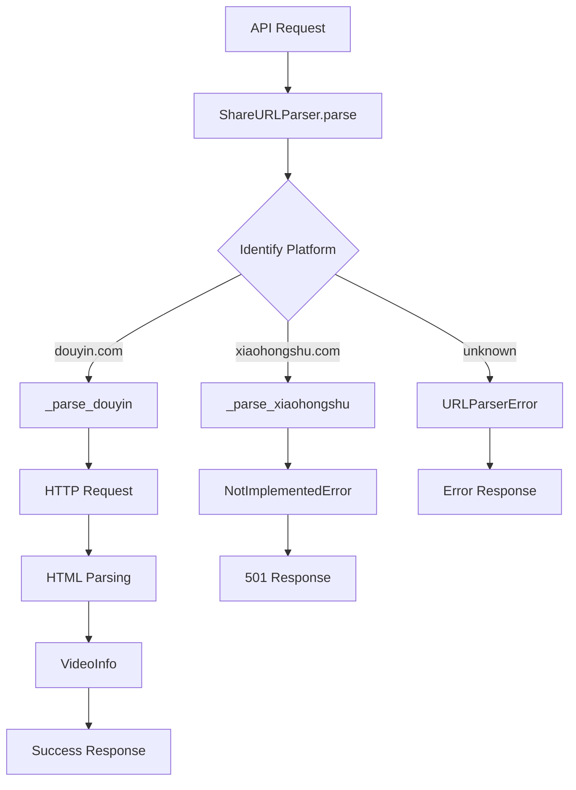

# Design Document

## Overview

This design implements a URL parsing module for extracting video information from platform-specific sharing URLs. The module follows a strategy pattern with platform-specific parsers, starting with Douyin (TikTok China) support. The design emphasizes extensibility, error handling, and testability through dependency injection and mocking.

## Architecture

### High-Level Design

The URL parser follows a modular architecture with clear separation of concerns:

1. **ShareURLParser**: Main orchestrator class that routes URLs to platform-specific parsers
2. **Platform-specific parsers**: Private methods that handle platform-specific parsing logic
3. **Data models**: Pydantic models for structured data representation
4. **Error handling**: Custom exceptions for different error scenarios

### Component Interaction



## Components and Interfaces

### ShareURLParser Class

#### Public Interface
```python
class ShareURLParser:
    async def parse(self, share_text: str) -> VideoInfo:
        """
        Parse video information from sharing text containing URL
        
        Args:
            share_text: Text containing video sharing URL
            
        Returns:
            VideoInfo: Structured video information
            
        Raises:
            URLParserError: When parsing fails or no URL found
            NotImplementedError: When platform is not supported
        """
```

#### Private Methods
```python
async def _parse_douyin(self, url: str) -> VideoInfo:
    """Parse Douyin video URL and extract video information"""

async def _parse_xiaohongshu(self, url: str) -> VideoInfo:
    """Placeholder for Xiaohongshu parsing - raises NotImplementedError"""

def _extract_url_from_text(self, text: str) -> str:
    """Extract URL from sharing text using regex"""

def _identify_platform(self, url: str) -> str:
    """Identify platform based on URL domain"""
```

### Data Models

#### VideoInfo Model
```python
class VideoInfo(BaseModel):
    video_id: str        # Platform-specific video identifier
    platform: str        # Platform name (e.g., 'douyin', 'xiaohongshu')
    title: str          # Video title
    download_url: str   # Direct video download URL
```

#### Custom Exceptions
```python
class URLParserError(Exception):
    """Custom exception for URL parsing errors"""
    pass
```

### HTTP Client Integration

The parser uses `httpx.AsyncClient` for HTTP requests with proper error handling:

```python
async with httpx.AsyncClient() as client:
    response = await client.get(url, follow_redirects=True)
    # Process response
```

## Data Models

### Input Data Flow

1. **Share Text Input**: Raw text containing sharing URL (e.g., from clipboard)
2. **URL Extraction**: Regex-based URL extraction from text
3. **Platform Identification**: Domain-based platform routing
4. **HTTP Request**: Fetch video page content
5. **Data Extraction**: Parse HTML/JSON for video metadata

### Output Data Structure

```python
VideoInfo(
    video_id="7123456789012345678",
    platform="douyin",
    title="Amazing Video Title",
    download_url="https://v26-web.douyinvod.com/..."
)
```

## Error Handling

### Error Categories

1. **Input Validation Errors**
   - No URL found in text → URLParserError
   - Invalid URL format → URLParserError

2. **Platform Support Errors**
   - Unsupported platform → NotImplementedError
   - Platform-specific parsing failures → URLParserError

3. **Network Errors**
   - HTTP request failures → URLParserError
   - Timeout errors → URLParserError

4. **Parsing Errors**
   - Invalid HTML structure → URLParserError
   - Missing JSON data → URLParserError

### Error Response Mapping

```python
try:
    result = await parser.parse(url_text)
except URLParserError as e:
    # Return 400 Bad Request
    raise HTTPException(status_code=400, detail=str(e))
except NotImplementedError as e:
    # Return 501 Not Implemented
    raise HTTPException(status_code=501, detail=str(e))
```

## Testing Strategy

### Unit Testing Approach

The testing strategy emphasizes isolated unit tests with comprehensive mocking:

#### Test Categories

1. **Successful Parsing Tests**
   - Mock HTTP responses with valid HTML
   - Verify VideoInfo object creation
   - Test platform routing logic

2. **Error Handling Tests**
   - Test NotImplementedError for unsupported platforms
   - Test URLParserError for various failure scenarios
   - Test network error handling

3. **Input Validation Tests**
   - Test URL extraction from various text formats
   - Test platform identification logic
   - Test edge cases and malformed inputs

#### Mocking Strategy

```python
@pytest.fixture
def mock_httpx_client():
    with patch('httpx.AsyncClient') as mock:
        yield mock

async def test_successful_douyin_parsing(mock_httpx_client):
    # Mock HTTP response with valid Douyin HTML
    mock_response = Mock()
    mock_response.text = DOUYIN_HTML_SAMPLE
    mock_httpx_client.return_value.__aenter__.return_value.get.return_value = mock_response
    
    # Test parsing logic
    parser = ShareURLParser()
    result = await parser.parse(DOUYIN_SHARE_TEXT)
    
    assert result.platform == "douyin"
    assert result.video_id is not None
```

## Implementation Details

### Douyin Parsing Logic

The Douyin parser follows this specific workflow:

1. **URL Processing**: Extract and follow redirects to get final video URL
2. **Video ID Extraction**: Parse video ID from URL path
3. **HTML Fetching**: Request video page HTML content
4. **JSON Extraction**: Find and parse `window._ROUTER_DATA` JavaScript object
5. **Metadata Extraction**: Extract title and download URL from JSON structure

### Platform Routing Logic

```python
def _identify_platform(self, url: str) -> str:
    if 'douyin.com' in url:
        return 'douyin'
    elif 'xiaohongshu.com' in url:
        return 'xiaohongshu'
    else:
        raise URLParserError(f"Unsupported platform in URL: {url}")
```

### URL Extraction Pattern

```python
def _extract_url_from_text(self, text: str) -> str:
    url_pattern = r'https?://[^\s]+'
    matches = re.findall(url_pattern, text)
    if not matches:
        raise URLParserError("No URL found in the provided text")
    return matches[0]  # Return first URL found
```

## Integration Points

### API Endpoint Integration

The parser integrates into the existing `/api/parse` endpoint:

```python
@app.post("/api/parse", response_model=VideoParseResponse)
async def parse_video(request: Request, ...):
    if "application/json" in content_type:
        try:
            body = await request.body()
            data = json.loads(body)
            if "url" in data:
                # NEW: Use ShareURLParser
                parser = ShareURLParser()
                video_info = await parser.parse(data["url"])
                
                return VideoParseResponse(
                    success=True,
                    data=AnalysisData(
                        transcript=f"Video: {video_info.title}",
                        analysis={"video_info": video_info.dict()}
                    )
                )
        except URLParserError as e:
            raise HTTPException(status_code=400, detail=str(e))
        except NotImplementedError as e:
            raise HTTPException(status_code=501, detail=str(e))
```

### Dependency Management

New dependencies to be added to `requirements.txt`:
- `httpx` (already present) - for HTTP requests
- No additional dependencies required

## Performance Considerations

### HTTP Request Optimization

- Use connection pooling through `httpx.AsyncClient`
- Implement request timeouts to prevent hanging
- Follow redirects automatically for sharing URLs

### Memory Management

- Stream large responses when possible
- Clean up HTTP client resources properly
- Avoid storing large HTML content in memory

### Error Recovery

- Implement retry logic for transient network errors
- Graceful degradation when parsing fails
- Clear error messages for debugging

## Security Considerations

### Input Validation

- Validate URL format before making requests
- Sanitize extracted URLs to prevent injection
- Limit request size and timeout

### Network Security

- Use HTTPS for all external requests
- Validate SSL certificates
- Implement rate limiting for external requests

### Data Privacy

- Don't log sensitive video content
- Handle user data according to privacy requirements
- Secure storage of temporary data if needed