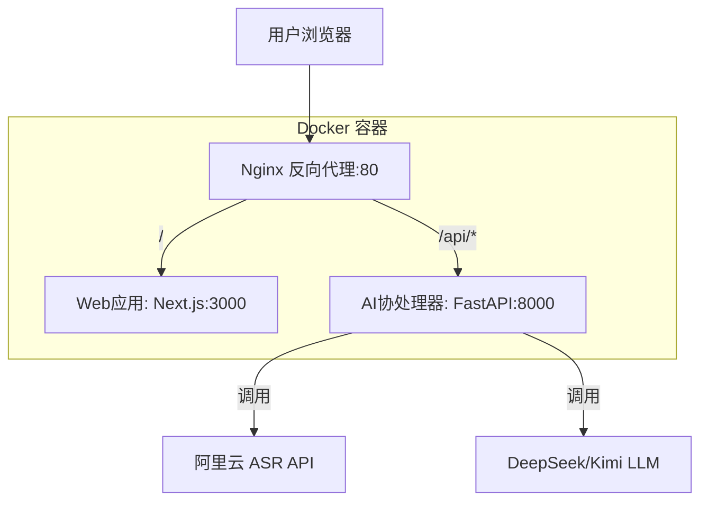

# ScriptParser 脚本快拆

一个基于 AI 的智能脚本解析工具，支持音频转文本和智能内容分析。

## 项目简介

ScriptParser 是一个基于 AI 的智能脚本解析工具，采用"**Web应用 + AI协处理器**"分离式架构模型：
- **Web应用**：基于 Next.js 14 的全栈 Web 应用，负责用户界面和业务逻辑
- **AI协处理器**：基于 FastAPI 的专用 AI 服务，专门处理音频转文本和智能解析
- **AI 能力**：集成阿里云 ASR 和 DeepSeek/Kimi LLM

## 技术栈

### Web 应用
- **Next.js** 14.2+ - 全栈 Web 框架，负责 UI 与业务逻辑
- **TypeScript** 5.5+ - 类型安全开发
- **Tailwind CSS** 3.4+ - 原子化 CSS 框架
- **shadcn/ui** 0.8+ - 基于 Tailwind 的组件库

### AI 协处理器
- **Python** 3.12+ - AI 协处理器编程语言
- **FastAPI** 0.111+ - 高性能 Python API 框架
- **Uvicorn** 0.29+ - ASGI 服务器

### 基础设施与部署
- **pnpm** 9.x+ - Monorepo 包管理器
- **Docker** - 应用容器化技术
- **Nginx** - 反向代理与流量分发

## 项目结构

```
script-parser/
├── apps/
│   ├── web/                 # Next.js Web应用 (UI + 业务逻辑)
│   │   ├── app/
│   │   ├── components/
│   │   └── package.json
│   └── coprocessor/         # FastAPI AI协处理器
│       ├── app/
│       │   ├── services/    # LLM适配器等AI服务
│       │   └── main.py
│       ├── requirements.txt
│       └── Dockerfile
├── packages/
│   └── ui/                  # 共享UI组件库 (可选)
├── scripts/
│   └── build-push.sh        # 构建并推送镜像脚本
├── nginx/
│   └── nginx.conf           # Nginx反向代理配置
├── docker-compose.yml       # 本地验证环境
├── .env.example             # 环境变量模板
├── package.json             # Monorepo根配置
└── pnpm-workspace.yaml      # pnpm workspace配置
```

## 快速开始

### 环境要求

- Node.js >= 20.x LTS
- pnpm >= 9.x
- Python >= 3.12
- Docker (可选，用于容器化部署)

### 环境要求

- **Node.js** >= 20.x LTS
- **pnpm** >= 9.x
- **Python** >= 3.12
- **Docker** & **Docker Compose** (用于容器化部署)

### 快速启动

#### 方式一：Docker 部署 (推荐)

1. **克隆项目**
```bash
git clone <repository-url>
cd script-parser
```

2. **配置环境变量**
```bash
# 复制环境变量模板
cp apps/coprocessor/.env.example apps/coprocessor/.env

# 编辑环境变量，填入实际的 API 密钥
# vim apps/coprocessor/.env
```

3. **启动服务**
```bash
# 构建并启动所有服务
docker-compose up --build -d

# 查看服务状态
docker-compose ps

# 查看日志
docker-compose logs -f
```

4. **访问应用**
- Web应用: http://localhost
- AI协处理器 API: http://localhost/api
- 健康检查: http://localhost/api/health

#### 方式二：本地开发

1. **安装依赖**
```bash
pnpm install
```

2. **启动Web应用**
```bash
pnpm --filter web dev
# 访问: http://localhost:3000
```

3. **启动AI协处理器**
```bash
cd apps/coprocessor

# 创建虚拟环境
python3 -m venv .venv
source .venv/bin/activate

# 安装依赖
pip install -r requirements.txt

# 启动服务
python -m uvicorn app.main:app --reload --port 8000
# 访问: http://localhost:8000
```

## API 接口

### AI协处理器 API

#### 健康检查
```bash
GET /api/health
# 响应: {"status": "healthy", "service": "ai-coprocessor"}
```

#### 音频转文本
```bash
POST /api/audio/transcribe
Content-Type: application/json

{
  "audio_url": "https://example.com/audio.mp3",
  "language": "zh-CN"
}

# 响应:
{
  "success": true,
  "transcript": "转录文本内容",
  "message": "Audio transcription successful"
}
```

#### 文本智能分析
```bash
POST /api/text/analyze
Content-Type: application/json

{
  "text": "待分析的文本内容",
  "analysis_type": "summary"
}

# 响应:
{
  "success": true,
  "result": "分析结果",
  "message": "Text analysis successful"
}
```

## 开发指南

### Web应用开发
- 基于 **Next.js 14** App Router 全栈框架
- 使用 **shadcn/ui** 组件库构建现代化界面
- **Tailwind CSS** 原子化样式系统
- **TypeScript** 提供完整类型安全保障

### AI协处理器开发
- **FastAPI** 构建高性能异步 API
- 集成 **阿里云 ASR** 和 **DeepSeek/Kimi LLM**
- 专注于音频转文本和智能解析功能
- 支持多种分析类型：摘要、关键词、情感分析等

### 添加新功能

1. **添加新的 API 端点**
```python
# apps/coprocessor/app/main.py
@app.post("/api/new-feature")
async def new_feature(request: NewFeatureRequest):
    # 实现新功能
    pass
```

2. **添加新的服务模块**
```python
# apps/coprocessor/app/services/new_service.py
class NewService:
    def __init__(self):
        pass
    
    async def process(self, data):
        # 处理逻辑
        pass
```

## 部署架构



### 服务说明
- **Nginx (端口80)**: 反向代理，统一入口
  - `/` → Web应用 (处理用户界面和业务逻辑)
  - `/api/*` → AI协处理器 (处理AI相关任务)
- **Web应用 (内部端口3000)**: Next.js 全栈应用
- **AI协处理器 (内部端口8000)**: FastAPI AI 服务

## 运维管理

### Docker 命令

```bash
# 启动服务
docker-compose up -d

# 查看服务状态
docker-compose ps

# 查看实时日志
docker-compose logs -f

# 查看特定服务日志
docker-compose logs -f web
docker-compose logs -f coprocessor
docker-compose logs -f nginx

# 重启服务
docker-compose restart

# 停止服务
docker-compose down

# 重新构建并启动
docker-compose up --build -d

# 清理资源
docker-compose down -v --rmi all
```

### 构建脚本

```bash
# 使用构建脚本
./scripts/build-push.sh

# 推送到镜像仓库
REGISTRY=your-registry.com TAG=v1.0.0 ./scripts/build-push.sh
```

### 环境变量配置

在 `apps/coprocessor/.env` 中配置：

```bash
# 阿里云ASR配置
ALIYUN_ASR_API_KEY=your_api_key
ALIYUN_ASR_API_SECRET=your_api_secret

# DeepSeek LLM配置
DEEPSEEK_API_KEY=your_deepseek_key

# 服务配置
HOST=0.0.0.0
PORT=8000
DEBUG=false
```

## 故障排除

### 常见问题

1. **端口冲突**
```bash
# 检查端口占用
lsof -i :80
lsof -i :3000
lsof -i :8000

# 修改 docker-compose.yml 中的端口映射
ports:
  - "8080:80"  # 改为其他端口
```

2. **容器启动失败**
```bash
# 查看详细错误日志
docker-compose logs <service-name>

# 重新构建镜像
docker-compose build --no-cache <service-name>
```

3. **API 调用失败**
```bash
# 检查服务健康状态
curl http://localhost/api/health

# 检查网络连通性
docker-compose exec web ping coprocessor
docker-compose exec coprocessor ping web
```

4. **环境变量未生效**
```bash
# 检查环境变量文件
cat apps/coprocessor/.env

# 重启服务使环境变量生效
docker-compose restart coprocessor
```

### 性能优化

1. **启用 Nginx 缓存**
2. **配置 CDN 加速静态资源**
3. **使用 Redis 缓存 AI 处理结果**
4. **配置负载均衡**

## 路线图

- [ ] 集成真实的阿里云 ASR API
- [ ] 集成 DeepSeek/Kimi LLM API
- [ ] 添加用户认证系统
- [ ] 支持批量音频处理
- [ ] 添加处理进度跟踪
- [ ] 支持多种音频格式
- [ ] 添加 WebSocket 实时通信
- [ ] 集成数据库存储
- [ ] 添加监控和日志系统

## 贡献指南

1. Fork 本仓库
2. 创建功能分支 (`git checkout -b feature/amazing-feature`)
3. 提交更改 (`git commit -m 'Add amazing feature'`)
4. 推送到分支 (`git push origin feature/amazing-feature`)
5. 创建 Pull Request

### 开发规范

- 遵循 TypeScript/Python 代码规范
- 添加适当的类型注解和文档
- 编写单元测试
- 更新相关文档

## 许可证

本项目采用 [MIT License](LICENSE) 开源协议。

## 联系方式

- 项目地址: [GitHub Repository]
- 问题反馈: [GitHub Issues]
- 文档地址: [Documentation]