# ScriptParser 脚本快拆

一个基于 AI 的智能脚本解析工具，支持音频转文本和智能内容分析。

## 项目简介

ScriptParser 是一个基于 AI 的智能脚本解析工具，采用"**Web应用 + AI协处理器**"分离式架构模型：
- **Web应用**：基于 Next.js 14 的全栈 Web 应用，负责用户界面和业务逻辑
- **AI协处理器**：基于 FastAPI 的专用 AI 服务，专门处理音频转文本和智能解析
- **AI 能力**：集成阿里云 ASR 和 Kimi/DeepSeek LLM（默认使用 Kimi）

## 技术栈

### Web 应用
- **Next.js** 14.2+ - 全栈 Web 框架，负责 UI 与业务逻辑
- **TypeScript** 5.5+ - 类型安全开发
- **Tailwind CSS** 3.4+ - 原子化 CSS 框架
- **shadcn/ui** 0.8+ - 基于 Tailwind 的组件库

### AI 协处理器
- **Python** 3.12+ - AI 协处理器编程语言
- **FastAPI** 0.111+ - 高性能 Python API 框架
- **Uvicorn** 0.29+ - ASGI 服务器

### 基础设施与部署
- **pnpm** 9.x+ - Monorepo 包管理器
- **Docker** - 应用容器化技术
- **Nginx** - 反向代理与流量分发

## 项目结构

```
script-parser/
├── apps/
│   ├── web/                 # Next.js Web应用 (UI + 业务逻辑)
│   │   ├── app/
│   │   ├── components/
│   │   └── package.json
│   └── coprocessor/         # FastAPI AI协处理器
│       ├── app/
│       │   ├── services/    # LLM适配器等AI服务
│       │   └── main.py
│       ├── requirements.txt
│       └── Dockerfile
├── packages/
│   └── ui/                  # 共享UI组件库 (可选)
├── scripts/
│   └── build-push.sh        # 构建并推送镜像脚本
├── nginx/
│   └── nginx.conf           # Nginx反向代理配置
├── docker-compose.yml       # 本地验证环境
├── .env.example             # 环境变量模板
├── package.json             # Monorepo根配置
└── pnpm-workspace.yaml      # pnpm workspace配置
```

## 快速开始

### 环境要求

- Node.js >= 20.x LTS
- pnpm >= 9.x
- Python >= 3.12
- Docker (可选，用于容器化部署)

### 环境要求

- **Node.js** >= 20.x LTS
- **pnpm** >= 9.x
- **Python** >= 3.12
- **Docker** & **Docker Compose** (用于容器化部署)

### 快速启动

#### 方式一：Docker 部署 (推荐)

1. **克隆项目**
```bash
git clone <repository-url>
cd script-parser
```

2. **配置环境变量**
```bash
# 复制环境变量模板
cp apps/coprocessor/.env.example apps/coprocessor/.env

# 编辑环境变量，填入实际的 API 密钥
# vim apps/coprocessor/.env
```

3. **启动服务**
```bash
# 构建并启动所有服务
docker-compose up --build -d

# 查看服务状态
docker-compose ps

# 查看日志
docker-compose logs -f
```

4. **访问应用**
- Web应用: http://localhost
- AI协处理器 API: http://localhost/api
- 健康检查: http://localhost/api/health

#### 方式二：本地开发

1. **安装依赖**
```bash
pnpm install
```

2. **启动Web应用**
```bash
pnpm --filter web dev
# 访问: http://localhost:3000
```

3. **启动AI协处理器**
```bash
cd apps/coprocessor

# 创建虚拟环境
python3 -m venv .venv
source .venv/bin/activate

# 安装依赖
pip install -r requirements.txt

# 启动服务
python -m uvicorn app.main:app --reload --port 8000
# 访问: http://localhost:8000
```

## API 接口

### AI协处理器 API

#### 健康检查
```bash
GET /api/health
# 响应: {"status": "healthy", "service": "ai-coprocessor"}
```

#### 音频转文本
```bash
POST /api/audio/transcribe
Content-Type: application/json

{
  "audio_url": "https://example.com/audio.mp3",
  "language": "zh-CN"
}

# 响应:
{
  "success": true,
  "transcript": "转录文本内容",
  "message": "Audio transcription successful"
}
```

#### 文本智能分析
```bash
POST /api/text/analyze
Content-Type: application/json

{
  "text": "待分析的文本内容",
  "analysis_type": "summary"
}

# 响应:
{
  "success": true,
  "result": "分析结果",
  "message": "Text analysis successful"
}
```

## 开发指南

### Web应用开发
- 基于 **Next.js 14** App Router 全栈框架
- 使用 **shadcn/ui** 组件库构建现代化界面
- **Tailwind CSS** 原子化样式系统
- **TypeScript** 提供完整类型安全保障

### AI协处理器开发
- **FastAPI** 构建高性能异步 API
- 集成 **阿里云 ASR** 和 **Kimi/DeepSeek LLM**（默认使用 Kimi）
- 专注于音频转文本和智能解析功能
- 支持多种分析类型：摘要、关键词、情感分析等

### 代码规范

项目使用简洁的代码规范配置：

**Web 应用 (Next.js)**
- ESLint: 基于 Next.js 推荐配置
- Prettier: 统一代码格式化
- TypeScript: 严格类型检查

**AI 协处理器 (Python)**
- Ruff: 现代化的 Python 代码检查和格式化工具
- 配置文件: `apps/coprocessor/pyproject.toml`

**通用配置**
- EditorConfig: 统一编辑器设置
- 格式化脚本: `./scripts/format.sh`

**Commit 规范**
- 格式: `<type>(<scope>): <subject>`
- 示例: `feat(api): add user authentication endpoint`
- 自动检查: Commitlint + Husky Git 钩子
- 详细规范: 查看 `docs/code-standards.md`

### 添加新功能

1. **添加新的 API 端点**
```python
# apps/coprocessor/app/main.py
@app.post("/api/new-feature")
async def new_feature(request: NewFeatureRequest):
    # 实现新功能
    pass
```

2. **添加新的服务模块**
```python
# apps/coprocessor/app/services/new_service.py
class NewService:
    def __init__(self):
        pass
    
    async def process(self, data):
        # 处理逻辑
        pass
```

## 部署架构

```mermaid
graph TD
    A[用户浏览器] --> B[Nginx 反向代理:80]
    B -->|"/"| C[Web应用: Next.js:3000]
    B -->|"/api/*"| D[AI协处理器: FastAPI:8000]
    D -->|调用| E[阿里云 ASR API]
    D -->|调用| F[Kimi/DeepSeek LLM]
    
    subgraph "Docker 容器"
        B
        C
        D
    end
```



### 服务说明
- **Nginx (端口80)**: 反向代理，统一入口
  - `/` → Web应用 (处理用户界面和业务逻辑)
  - `/api/*` → AI协处理器 (处理AI相关任务)
- **Web应用 (内部端口3000)**: Next.js 全栈应用
- **AI协处理器 (内部端口8000)**: FastAPI AI 服务

## 运维管理

### Docker 命令

```bash
# 启动服务
docker-compose up -d

# 查看服务状态
docker-compose ps

# 查看实时日志
docker-compose logs -f

# 查看特定服务日志
docker-compose logs -f web
docker-compose logs -f coprocessor
docker-compose logs -f nginx

# 重启服务
docker-compose restart

# 停止服务
docker-compose down

# 重新构建并启动
docker-compose up --build -d

# 清理资源
docker-compose down -v --rmi all
```

### 构建脚本

```bash
# 使用构建脚本
./scripts/build-push.sh

# 推送到镜像仓库
REGISTRY=your-registry.com TAG=v1.0.0 ./scripts/build-push.sh
```

### 环境变量配置

在 `apps/coprocessor/.env` 中配置：

```bash
# 阿里云ASR配置
ALIYUN_ASR_API_KEY=your_api_key
ALIYUN_ASR_API_SECRET=your_api_secret

# Kimi LLM配置 (主要)
KIMI_API_KEY=your_kimi_key

# DeepSeek LLM配置 (备选)
DEEPSEEK_API_KEY=your_deepseek_key

# 服务配置
HOST=0.0.0.0
PORT=8000
DEBUG=false
```

## 故障排除

### 常见问题

1. **端口冲突**
```bash
# 检查端口占用
lsof -i :80
lsof -i :3000
lsof -i :8000

# 修改 docker-compose.yml 中的端口映射
ports:
  - "8080:80"  # 改为其他端口
```

2. **容器启动失败**
```bash
# 查看详细错误日志
docker-compose logs <service-name>

# 重新构建镜像
docker-compose build --no-cache <service-name>
```

3. **API 调用失败**
```bash
# 检查服务健康状态
curl http://localhost/api/health

# 检查网络连通性
docker-compose exec web ping coprocessor
docker-compose exec coprocessor ping web
```

4. **环境变量未生效**
```bash
# 检查环境变量文件
cat apps/coprocessor/.env

# 重启服务使环境变量生效
docker-compose restart coprocessor
```

### 性能优化

1. **启用 Nginx 缓存**
2. **配置 CDN 加速静态资源**
3. **使用 Redis 缓存 AI 处理结果**
4. **配置负载均衡**

## 路线图

- [ ] 集成真实的阿里云 ASR API
- [ ] 集成 Kimi/DeepSeek LLM API
- [ ] 添加用户认证系统
- [ ] 支持批量音频处理
- [ ] 添加处理进度跟踪
- [ ] 支持多种音频格式
- [ ] 添加 WebSocket 实时通信
- [ ] 集成数据库存储
- [ ] 添加监控和日志系统

## 贡献指南

1. Fork 本仓库
2. 创建功能分支 (`git checkout -b feature/amazing-feature`)
3. 提交更改 (`git commit -m 'Add amazing feature'`)
4. 推送到分支 (`git push origin feature/amazing-feature`)
5. 创建 Pull Request

### 开发规范

- 遵循 TypeScript/Python 代码规范
- 添加适当的类型注解和文档
- 编写单元测试
- 更新相关文档

## 许可证

本项目采用 [MIT License](LICENSE) 开源协议。

## 联系方式

- 项目地址: [GitHub Repository]
- 问题反馈: [GitHub Issues]
- 文档地址: [Documentation]
## 🚀 生产环境部署更新流程

### 架构说明

生产环境采用 **volumes 挂载** 模式：
- 容器使用预构建镜像提供基础环境
- 本地代码通过 volumes 挂载到容器
- **优势**：`git pull` 后只需重启服务即可生效，无需重新构建镜像

### 🍎 Mac mini 快速部署（推荐）

**适用场景**：日常开发迭代、后端代码更新

#### 一键快速部署

Mac mini 上提供了专门的快速部署脚本：

```bash
cd /Volumes/ExternalLiumw/lavori/01_code/15-liumw/03-script-parse
./deploy-macmini-quick.sh
```

脚本会自动完成：
1. ✅ 检测并拉取最新代码
2. ✅ 自动处理本地修改冲突
3. ✅ 重启后端服务（使用挂载的代码）
4. ✅ 健康检查和服务状态验证

#### 手动快速部署

如果需要手动操作：

```bash
# 1. 拉取最新代码
cd /Volumes/ExternalLiumw/lavori/01_code/15-liumw/03-script-parse
git pull origin main

# 2. 重启后端服务（代码通过 volumes 挂载，无需重新构建）
/usr/local/bin/docker-compose -f docker-compose.macmini.yml restart coprocessor

# 3. 验证服务
curl http://localhost:8081/api/health
```

**重要提示**：
- ✅ **后端代码更新**：只需重启服务（30秒内完成）
- ⚠️ **前端代码更新**：需要重新构建镜像（约10-15分钟）
- 📦 **环境变量更新**：修改 `.env` 文件后重启服务

#### 前端代码更新（需要重新构建）

如果前端有改动，需要完整部署：

```bash
cd /Volumes/ExternalLiumw/lavori/01_code/15-liumw/03-script-parse
./deploy-macmini.sh
```

### 快速更新部署

在腾讯云VPS上更新代码的流程：

```bash
# 1. 拉取最新代码
git pull origin main

# 2. 重启后端服务（应用代码变更）
docker-compose -f docker-compose.prod.yml restart coprocessor

# 3. 验证服务状态
curl -f http://localhost:8081/api/health
docker-compose -f docker-compose.prod.yml logs --tail=10 coprocessor
```

### 一键部署脚本

项目提供了自动化部署脚本 `deploy.sh`：

```bash
# 直接运行
./deploy.sh
```

脚本会自动完成：
1. ✅ 拉取最新代码
2. ✅ 重启后端服务
3. ✅ 健康检查
4. ✅ 显示服务状态和日志

### 完整重启（如需重启所有服务）

```bash
# 停止所有服务
docker-compose -f docker-compose.prod.yml down

# 启动所有服务
docker-compose -f docker-compose.prod.yml up -d

# 验证
docker-compose -f docker-compose.prod.yml ps
curl -f http://localhost:8081/api/health
```
    echo "❌ 错误: 请在项目根目录运行此脚本"
    exit 1
fi

# 停止现有服务
echo "⏹️ 停止现有服务..."
docker-compose -f docker-compose.prod.yml down

# 拉取最新代码
echo "📥 拉取最新代码..."
if git pull origin main; then
    echo "✅ 代码更新成功"
else
    echo "❌ 代码更新失败"
    exit 1
fi

# 启动服务
echo "🚀 启动服务..."
if docker-compose -f docker-compose.prod.yml up -d; then
    echo "✅ 服务启动成功"
else
    echo "❌ 服务启动失败"
    exit 1
fi

# 等待服务启动
echo "⏳ 等待服务启动..."
sleep 15

# 验证服务状态
echo "📊 服务状态:"
docker-compose -f docker-compose.prod.yml ps

# 健康检查
echo "🔍 健康检查:"
if curl -f -s http://localhost:8081/api/health > /dev/null; then
    echo "✅ API 健康检查通过"
else
    echo "⚠️  API 健康检查可能失败，请查看日志"
fi

# 获取外网IP
EXTERNAL_IP=$(curl -s ifconfig.me)
echo ""
echo "🎉 部署完成!"
echo "🌐 访问地址: http://${EXTERNAL_IP}:8081"
echo "📋 查看日志: docker-compose -f docker-compose.prod.yml logs -f"
echo "=================================="
SCRIPT

# 给脚本执行权限
chmod +x deploy.sh

# 运行部署
./deploy.sh
```

### 环境要求

#### 腾讯云VPS配置建议
- **CPU**: 2核以上
- **内存**: 4GB以上 
- **磁盘**: 20GB以上
- **带宽**: 根据访问量选择
- **操作系统**: Ubuntu 20.04+ / CentOS 8+ / OpenCloudOS

#### 必要软件
```bash
# 安装 Docker
curl -fsSL https://get.docker.com | bash
systemctl start docker
systemctl enable docker

# 安装 Docker Compose（如果没有）
sudo curl -L "https://github.com/docker/compose/releases/latest/download/docker-compose-$(uname -s)-$(uname -m)" -o /usr/local/bin/docker-compose
sudo chmod +x /usr/local/bin/docker-compose

# 安装 Git
sudo apt update && sudo apt install git -y  # Ubuntu/Debian
# 或
sudo yum install git -y  # CentOS/RHEL
```

### 安全配置

#### 防火墙设置
```bash
# 配置防火墙（Ubuntu/Debian）
sudo ufw allow 22     # SSH
sudo ufw allow 8081   # 应用端口
sudo ufw enable

# 或者（CentOS/RHEL）
sudo firewall-cmd --permanent --add-port=22/tcp
sudo firewall-cmd --permanent --add-port=8081/tcp
sudo firewall-cmd --reload
```

#### SSL/HTTPS配置（可选）
```bash
# 使用 Let's Encrypt 配置 HTTPS
# 1. 安装 Certbot
sudo apt install certbot python3-certbot-nginx -y

# 2. 获取证书
sudo certbot --nginx -d your-domain.com

# 3. 修改 docker-compose.prod.yml 中的 nginx 端口映射
# ports:
#   - "80:80"
#   - "443:443"
```

### 监控和维护

#### 日志管理
```bash
# 查看实时日志
docker-compose -f docker-compose.prod.yml logs -f

# 查看特定服务日志
docker-compose -f docker-compose.prod.yml logs -f web
docker-compose -f docker-compose.prod.yml logs -f coprocessor
docker-compose -f docker-compose.prod.yml logs -f nginx

# 清理日志（谨慎使用）
docker system prune -f
```

#### 系统监控
```bash
# 查看系统资源使用
docker stats

# 查看磁盘使用
df -h

# 查看内存使用
free -m

# 查看服务端口占用
netstat -tulpn | grep :8081
```

#### 备份策略
```bash
# 备份重要配置文件
cp docker-compose.prod.yml docker-compose.prod.yml.backup.$(date +%Y%m%d)
cp .env .env.backup.$(date +%Y%m%d)

# 定期备份（添加到 crontab）
# 0 2 * * * cd /opt/script-parser && cp docker-compose.prod.yml docker-compose.prod.yml.backup.$(date +\%Y\%m\%d)
```

### 故障排除

#### 常见问题

**1. 端口冲突**
```bash
# 检查端口占用
lsof -i :8081
netstat -tulpn | grep :8081

# 修改 docker-compose.prod.yml 中的端口映射
ports:
  - "8080:80"  # 改为其他端口
```

**2. 服务启动失败**
```bash
# 查看详细错误日志
docker-compose -f docker-compose.prod.yml logs <service-name>

# 重新拉取镜像
docker-compose -f docker-compose.prod.yml pull

# 强制重创建容器
docker-compose -f docker-compose.prod.yml up -d --force-recreate
```

**3. API 调用失败**
```bash
# 检查服务健康状态
curl -v http://localhost:8081/api/health

# 检查网络连通性
docker-compose -f docker-compose.prod.yml exec web ping coprocessor
docker-compose -f docker-compose.prod.yml exec coprocessor ping web
```

**4. 环境变量未生效**
```bash
# 检查环境变量文件
cat .env

# 重启服务使环境变量生效
docker-compose -f docker-compose.prod.yml restart coprocessor
```

### 性能优化

#### 服务器优化
```bash
# 增加文件描述符限制
echo "* soft nofile 65536" >> /etc/security/limits.conf
echo "* hard nofile 65536" >> /etc/security/limits.conf

# 优化内核参数
echo "net.core.somaxconn = 65535" >> /etc/sysctl.conf
sysctl -p
```

#### Docker 优化
```bash
# 配置 Docker daemon
cat > /etc/docker/daemon.json << 'JSON'
{
  "log-driver": "json-file",
  "log-opts": {
    "max-size": "10m",
    "max-file": "3"
  },
  "storage-driver": "overlay2"
}
JSON

systemctl restart docker
```

### 更新记录

| 日期 | 版本 | 更新内容 |
|------|------|---------|
| 2024-10-10 | v1.1 | 添加定价页面、Footer组件、SEO优化 |
| 2024-09-27 | v1.0 | 初始生产环境部署 |

### 联系支持

如果在部署过程中遇到问题，请：
1. 查看上述故障排除指南
2. 检查服务日志: `docker-compose -f docker-compose.prod.yml logs`
3. 提交 Issue 到 GitHub 仓库
4. 联系技术支持


---

## 📚 生产环境部署指南

### 生产环境架构概览

```
外网 HTTPS (443)
    ↓
宝塔 Nginx (80/443)
    ↓ 反向代理
Docker Nginx (8081)
    ↓
    ├─→ Web (3000) - Next.js 前端
    └─→ API (8000) - FastAPI 后端
```

### 环境信息

- **服务器**: 腾讯云 VPS (OpenCloudOS)
- **域名**: https://sp.persimorrow.online
- **镜像仓库**: 腾讯云 TCR (ccr.ccs.tencentyun.com/baokuan-jieqouqi)
- **项目路径**: `/opt/script-parser`
- **配置文件**: `docker-compose.prod.yml`

### 关键配置说明

#### 1. API URL 配置

**⚠️ 重要**: 前端的 `NEXT_PUBLIC_API_URL` 在**构建时**被编译到代码中，不能在运行时修改。

```bash
# .env 文件配置
NEXT_PUBLIC_API_URL=https://sp.persimorrow.online

# 前端代码会自动拼接 /api 路径
# 实际请求: https://sp.persimorrow.online/api/parse
```

#### 2. 端口映射

```yaml
# 宝塔 Nginx: 80/443 (外网)
#   ↓ 代理到
# Docker Nginx: 8081 (内网)
#   ↓ 分发到
# Web: 3000 (容器内部)
# API: 8000 (容器内部)
```

#### 3. 健康检查

容器使用 `wget` 而非 `curl` 进行健康检查：

```yaml
healthcheck:
  test: ["CMD", "wget", "--spider", "-q", "http://localhost:3000"]
```

### 标准部署流程

#### 方式一：仅更新后端代码（推荐）

后端使用 volumes 挂载，代码更改后只需重启：

```bash
cd /opt/script-parser
git pull origin main
docker-compose -f docker-compose.prod.yml restart coprocessor
docker-compose -f docker-compose.prod.yml logs -f coprocessor
```

#### 方式二：更新前端代码

前端需要重新构建镜像并推送到 TCR：

```bash
cd /opt/script-parser
git pull origin main

# 构建并推送镜像（需要 docker login）
REGISTRY=ccr.ccs.tencentyun.com/baokuan-jieqouqi ./scripts/build-push.sh

# 拉取最新镜像并重启
docker-compose -f docker-compose.prod.yml pull web
docker-compose -f docker-compose.prod.yml up -d
```

#### 方式三：完整重新部署

```bash
cd /opt/script-parser
git pull origin main

# 停止所有服务
docker-compose -f docker-compose.prod.yml down

# 重新构建并推送（如果前端有改动）
REGISTRY=ccr.ccs.tencentyun.com/baokuan-jieqouqi ./scripts/build-push.sh

# 启动服务
docker-compose -f docker-compose.prod.yml pull
docker-compose -f docker-compose.prod.yml up -d

# 查看状态
docker-compose -f docker-compose.prod.yml ps
docker-compose -f docker-compose.prod.yml logs -f
```

### 常见问题排查

#### 1. Mixed Content 错误（HTTPS 请求 HTTP）

**症状**: 浏览器控制台显示 Mixed Content 错误，前端请求被阻止

**原因**: 前端使用了 HTTP URL 而非 HTTPS

**排查**:
```bash
# 检查前端容器的环境变量
docker exec sp_frontend printenv NEXT_PUBLIC_API_URL

# 应该输出: https://sp.persimorrow.online
```

**解决**: 重新构建前端镜像（参考"方式二"）

#### 2. 健康检查失败

**症状**: `docker ps` 显示容器 `unhealthy`

**常见原因**:
- 容器内缺少 `curl` 或 `wget`
- 应用启动失败
- 端口配置错误

**排查**:
```bash
# 查看健康检查日志
docker inspect sp_frontend --format='{{json .State.Health}}' | python3 -m json.tool
docker inspect sp_backend --format='{{json .State.Health}}' | python3 -m json.tool

# 查看应用日志
docker-compose -f docker-compose.prod.yml logs web --tail 50
docker-compose -f docker-compose.prod.yml logs coprocessor --tail 50
```

#### 3. API 调用 404

**症状**: 前端请求 API 返回 404

**排查**:
```bash
# 测试 Docker Nginx
curl http://localhost:8081/api/health

# 测试外网访问
curl https://sp.persimorrow.online/api/health

# 查看 Nginx 日志
docker-compose -f docker-compose.prod.yml logs nginx --tail 50

# 检查宝塔 Nginx 配置
cat /www/server/panel/vhost/nginx/sp.persimorrow.online.conf
cat /www/server/panel/vhost/nginx/proxy/sp.persimorrow.online/*.conf
```

#### 4. 镜像构建失败

**症状**: `build-push.sh` 执行失败

**常见原因**:
- Docker 登录过期
- 网络问题
- 构建参数错误

**排查**:
```bash
# 重新登录 TCR
docker login ccr.ccs.tencentyun.com

# 检查 Docker buildx
docker buildx ls

# 手动构建测试
docker build --build-arg NEXT_PUBLIC_API_URL=https://sp.persimorrow.online \
  -f apps/web/Dockerfile -t test-web .
```

### 验证部署

部署完成后，运行以下命令验证：

```bash
# 1. 检查服务状态
docker-compose -f docker-compose.prod.yml ps

# 2. 测试内网 API
curl http://localhost:8081/api/health

# 3. 测试外网 API
curl https://sp.persimorrow.online/api/health

# 4. 检查前端环境变量
docker exec sp_frontend printenv NEXT_PUBLIC_API_URL

# 5. 查看最近日志
docker-compose -f docker-compose.prod.yml logs --tail 20
```

### 监控命令

```bash
# 实时查看所有日志
docker-compose -f docker-compose.prod.yml logs -f

# 查看特定服务日志
docker-compose -f docker-compose.prod.yml logs -f web
docker-compose -f docker-compose.prod.yml logs -f coprocessor
docker-compose -f docker-compose.prod.yml logs -f nginx

# 查看资源使用
docker stats

# 查看容器详情
docker inspect sp_frontend
docker inspect sp_backend
docker inspect sp_nginx
```

### 配置文件位置

```
/opt/script-parser/
├── .env                        # 环境变量配置
├── docker-compose.prod.yml     # 生产环境配置
├── nginx/nginx.conf           # Docker Nginx 配置
├── apps/
│   ├── web/
│   │   ├── Dockerfile         # 前端构建文件
│   │   └── src/lib/api-client.ts  # API 客户端
│   └── coprocessor/
│       ├── Dockerfile         # 后端构建文件
│       └── app/               # 后端代码（volumes 挂载）
└── scripts/
    └── build-push.sh          # 构建推送脚本
```

### 重要提醒

1. **前端改动必须重新构建镜像**：`NEXT_PUBLIC_*` 变量在构建时固化
2. **后端改动只需重启容器**：使用 volumes 挂载，代码实时生效
3. **修改 API URL 后必须推送新镜像**：否则前端仍使用旧 URL
4. **生产环境使用 `docker-compose.prod.yml`**：不要使用其他配置文件
5. **推送镜像前先登录 TCR**：`docker login ccr.ccs.tencentyun.com`

