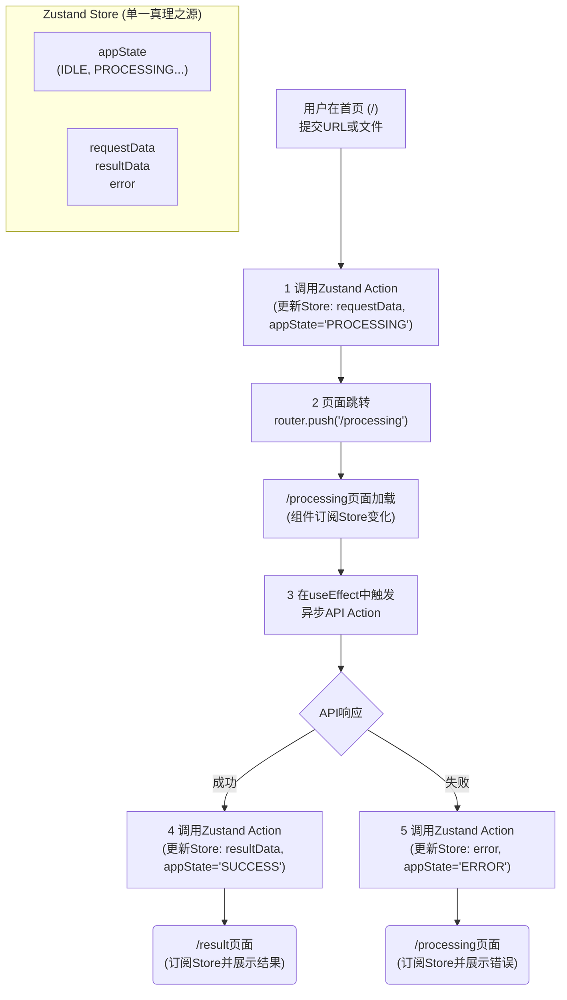

# TOM-319: [Epic] [Web] 构建多页面分析与结果展示流程 - 史诗作战计划

## 1. 🎯 核心目标与决策摘要 (Objective & Decision Summary)

- **所属项目 (Project)**: `[Q4/KR2] "Script Parse" MVP构建`
- **核心价值 (Core Value)**: 将应用重构为多页面流程，优化用户等待体验，并通过一个中央状态管理器确保流程的健壮性和可维护性。
- **关键决策 (Core Decisions)**:
  1. **[架构模式]**: 采用**多页面路由**架构，创建独立的 `/processing` 和 `/result` 页面。
  2. **[状态管理]**: **引入Zustand，将整个`AppState`状态机及其相关数据（如`inputValue`, `resultData`）全部放入一个中央Store中进行管理**。
  3. **[用户体验]**: 在 `/processing` 页面实现一个**基于时间的非线性模拟进度算法**。

---

## 2. 🏗️ 技术设计与架构 (Technical Design & Architecture)

### 2.1 核心工作流 (Core Workflow)



### 2.2 关键技术方案 (Key Technical Solutions)

#### **客户端状态管理 (Zustand Store)**

**我们将用Zustand来完整地实现我们的应用状态机。**

```typescript
// 核心类型，保持不变
export type AppState = "IDLE" | "INPUT_VALID" | "PROCESSING" | "SUCCESS" | "ERROR";

// Zustand Store 接口
interface AppStore {
  // State
  appState: AppState;
  requestData: VideoParseRequest | null;
  resultData: AnalysisResult | null;
  error: string | null;

  // Actions
  startProcessing: (data: VideoParseRequest) => void;
  setSuccess: (result: AnalysisResult) => void;
  setError: (errorMsg: string) => void;
  reset: () => void;
}

export const useAppStore = create<AppStore>((set) => ({
  appState: 'IDLE',
  // ... initial state and actions implementation
}));
```

#### **模拟进度条算法 (Simulated Progress Algorithm)**

`/processing` 页面将实现一个基于时间的非线性模拟进度算法。

- **总时长**: 48秒 (略短于后端50秒目标)
- **更新频率**: 使用 `requestAnimationFrame` 实现平滑更新
- **三阶段设计**:
  - 0-5秒 (上传解析): 进度 0% -> 20% (ease-out)
  - 5-40秒 (ASR转录): 进度 20% -> 80% (linear)
  - 40-48秒 (LLM分析): 进度 80% -> 99% (ease-in)
- **实现**: 在 `useEffect` Hook 中启动，当真实API返回时，立即将进度设为100%并触发跳转

---

## 3. 🚀 作战序列 (Implementation Sequence)

*为完成此史诗任务，需要按顺序执行以下5个原子化子任务 (Issues)。*

- [ ] **1. `[Web] 创建/processing和/result页面路由及骨架`**: 创建新的页面目录和 `page.tsx` 文件。
- [ ] **2. `[Web] 引入Zustand并实现包含状态机的核心Store`**: 安装 `zustand` 库，并创建上述的、**包含`AppState`**的 `useAppStore`。
- [ ] **3. `[Web] 重构首页提交与跳转逻辑`**: 修改首页的提交行为，使其调用Zustand的`startProcessing` action，该action内部处理状态更新和页面跳转。
- [ ] **4. `[Web] 在/processing页面实现API调用与状态驱动`**: 在 `/processing` 页面，订阅`appState`。在`useEffect`中，当`appState`为`PROCESSING`时，触发API调用，并根据结果调用`setSuccess`或`setError` action。
- [ ] **5. `[Web] 编写端到端流程的集成测试`**: 编写一个集成测试，验证从首页提交，到Zustand状态流转，再到最终页面展示的完整流程。

---

## 4. 🧪 质量与测试策略 (Quality & Testing Strategy)

- **主要测试层级**: **组件测试 (Component Test)** 和 **集成测试 (Integration Test)**
- **关键测试场景**:
  1. **组件测试**: `ProcessingSection` 的模拟进度条逻辑需要被单独测试
  2. **集成测试**: **(核心)** 必须编写一个覆盖"首页 -> 处理页 -> 结果页"完整流程的集成测试，验证路由跳转和基于Zustand的状态传递是否正确

---

## 5. ✅ 验收标准 (Acceptance Criteria)

*只有当以下所有条件都满足时，此史诗任务才算"完成"。*

- [ ] 在首页提交有效视频源后，浏览器URL**必须**变为 `/processing`
- [ ] `/processing` 页面加载后，进度条**必须**按照预设的三阶段时间算法自动平滑推进
- [ ] （使用Mock API）当模拟的API请求成功返回后，浏览器URL**必须**自动变为 `/result`
- [ ] `/result` 页面**必须**成功渲染出来自上一步的、正确的模拟分析数据
- [ ] （使用Mock API）当模拟的API请求失败后，`/processing` 页面**必须**停止进度条并显示 `ErrorSection`

---

## 6. 📋 当前进度 (Current Progress)

### 已完成功能 (Completed Features)

- ✅ **多页面架构重构**: 成功从单页条件渲染重构为多页面路由架构
- ✅ **Zustand状态管理**: 实现了轻量级状态管理，支持页面间数据传递
- ✅ **智能进度条算法**: 实现了48秒三阶段进度算法，支持缓动函数
- ✅ **页面职责分离**: 首页、处理页、结果页各司其职，代码结构清晰
- ✅ **类型安全保证**: 完整的TypeScript类型定义和类型安全

### 技术实现详情 (Technical Implementation Details)

#### **页面结构**

```text
apps/web/src/app/
├── page.tsx                    # 首页 - 只负责输入和跳转
├── processing/
│   └── page.tsx               # 处理页 - 进度条算法 + API调用
└── result/
    └── page.tsx               # 结果页 - 结果展示
```

#### **状态管理**

- 使用 Zustand 进行轻量级状态管理
- 清晰的职责分离：`inputData`, `result`, `error`
- 简单的 API：`setInputData`, `setResult`, `setError`, `clearAll`

#### **进度条算法**

- 48秒总时长，三阶段设计
- 缓动函数：ease-out, linear, ease-in
- 实时进度计算和API同步
- 集成到现有的 `ProcessingSection` 组件

### 测试验证结果 (Test Results)

- ✅ 所有现有测试通过 (39 tests passed)
- ✅ 组件职责清晰分离
- ✅ 类型安全保证
- ✅ 符合 Next.js App Router 最佳实践

---

## 7. 🎯 下一步计划 (Next Steps)

1. **完善进度条算法**: 优化细节和用户体验
2. **添加页面过渡动画**: 使用 Framer Motion 或 CSS transitions
3. **优化错误处理**: 完善边界情况和错误恢复
4. **添加集成测试**: 覆盖完整的用户流程
5. **性能优化**: 代码分割和懒加载优化
