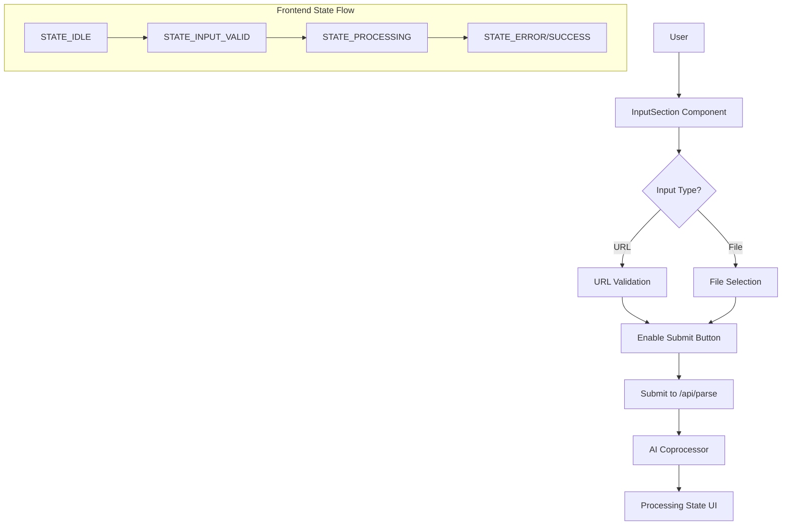

# TOM-318:dev:实现灵活的视频输入功能 (URL与文件上传)

- **Status**: 🎯 Frontend Complete (仅后端API开发待完成)

---

## 1. 🎯 Design Overview
- **Objective**: 为"脚本快拆"应用构建一个无摩擦的、支持URL和文件两种模式的视频输入界面，为用户核心旅程的第一步奠定坚实、流畅的体验基础。用户可以通过URL（如抖音、小红书分享链接）或本地文件上传的方式来提交视频进行处理。
- **Scope**: 
  - 前端: 实现InputSection组件，包含URL输入和文件上传两种输入方式
  - 后端: 创建`/api/parse`端点，支持接收URL和multipart/form-data文件上传
  - 状态管理: 实现输入验证、按钮状态切换和处理中状态的UI反馈
- **Core Decisions**:
    1. **前端组件架构**: 使用shadcn/ui组件库构建InputSection组件，遵循"本地状态优先"原则进行状态管理
    2. **API设计**: 统一使用`/api/parse`端点处理两种输入方式，通过Content-Type区分处理逻辑
    3. **用户体验**: 实现渐进式状态反馈（IDLE → INPUT_VALID → PROCESSING），提供清晰的错误提示

---

## 2. 🏗️ Technical Architecture
- **Tech Stack**: 
  - Frontend: Next.js 14 (App Router), TypeScript 5.5+, Tailwind CSS 3.4+, shadcn/ui 0.8+
  - Backend: FastAPI 0.111+, Python 3.12+, Pydantic
  - Infrastructure: Docker, Nginx (反向代理)

- **Components & Data Flow**:


- **API Endpoints**:
    - `POST /api/parse`: 统一的视频解析端点
      - Content-Type: `application/json` (URL模式)
      - Content-Type: `multipart/form-data` (文件上传模式)

---

## 3. 🚀 Implementation Plan
- **Step 1: 后端API端点开发** - ⏳ 待开发：在FastAPI协处理器中创建`/api/parse`端点，支持两种Content-Type的请求处理
- **Step 2: InputSection组件静态UI** - ✅ 已完成：使用shadcn/ui组件构建包含URL输入框、文件上传链接和提交按钮的静态界面
- **Step 3: 前端状态管理与验证** - ✅ 已完成：实现URL格式验证、按钮状态联动和错误提示显示逻辑
- **Step 4: API客户端集成** - ✅ 已完成：创建前端API客户端，实现与后端`/api/parse`端点的数据交互 (TOM-325)
- **Step 5: 文件上传功能** - ✅ 已完成：实现文件选择器触发和multipart/form-data上传逻辑
- **Step 6: 处理状态UI反馈** - ✅ 已完成：实现提交后的"处理中"状态显示和用户反馈
- **Step 7: 组件架构重构** - ✅ 已完成：重构InputSection为受控组件，增强URL提取功能 (TOM-323)
- **Step 8: 测试框架搭建** - ✅ 已完成：配置Jest测试环境，实现100%验证工具测试覆盖率
- **Step 9: 项目文档完善** - ✅ 已完成：全面重写README，添加详细的开发指南和架构说明
- **Step 10: 文件上传逻辑实现** - ✅ 已完成：实现前端文件上传逻辑，完整的文件验证和状态管理 (TOM-324)
- **Step 11: API Client集成** - ✅ 已完成：实现API Client并对接/api/parse接口，完整的前后端数据流 (TOM-325)

---

## 4. ✅ Quality & Testing
- **Code Quality**: 
  - 遵循TypeScript严格类型检查，禁用`any`类型
  - 遵循React函数组件和Hooks最佳实践
  - 使用TSDoc为所有导出的组件和函数添加文档注释
  - 遵循项目命名规范：组件文件使用PascalCase，工具函数使用kebab-case
- **Testing Strategy**: 
  - ✅ **单元测试**: 使用Jest + Testing Library测试URL验证逻辑和状态管理函数，已实现100%覆盖率
  - ✅ **测试框架配置**: 完整的Jest + Next.js + jsdom测试环境，包含Mock配置和覆盖率报告
  - ✅ **验证工具测试**: 17个测试用例覆盖URL提取、验证、文件验证等所有场景
  - ✅ **API Client测试**: 10个测试用例覆盖parseVideo函数的所有请求类型和错误场景
  - ✅ **文件处理逻辑测试**: 5个测试用例覆盖文件上传的状态管理和验证逻辑
  - ⏳ **组件测试**: 使用React Testing Library测试InputSection组件的用户交互 (待开发)
  - ⏳ **集成测试**: 测试前端与`/api/parse`端点的完整数据流 (待开发)
  - ⏳ **E2E测试**: 使用Playwright测试完整的用户输入到处理状态的流程 (待开发)

---

## 5. 📋 Acceptance Criteria

基于Linear issue TOM-318的验收标准：

- [x] **UI组件完整性**: InputSection组件包含URL输入框、文件上传链接和提交按钮，按照原型设计正确渲染
- [x] **URL验证功能**: 粘贴有效URL（如包含douyin.com的链接）时，提交按钮从禁用状态切换为启用状态
- [x] **错误提示显示**: 输入无效格式URL时，在输入框下方显示清晰的错误提示信息
- [x] **文件选择功能**: 点击"上传本地视频文件"链接能成功打开操作系统的文件选择器
- [x] **API请求正确性**: 
  - ✅ URL提交: parseVideo函数发送POST请求到`/api/parse`，Content-Type为`application/json`，请求体为`{ "type": "url", "url": "..." }`
  - ✅ 文件提交: parseVideo函数发送POST请求到`/api/parse`，Content-Type为`multipart/form-data`，包含文件和类型字段
- [x] **状态流转正确**: 成功提交后，UI界面正确从输入状态流转到"处理中"状态，显示分阶段的文本反馈
- [x] **处理中状态**: 点击提交按钮后，整个输入区域变为禁用状态，并显示"处理中"的反馈

---

## 6. 🔧 Technical Implementation Details

### 6.1 Backend API Schema
```python
# Request Models
class VideoParseURLRequest(BaseModel):
    url: str
    
class VideoParseResponse(BaseModel):
    success: bool
    message: str
    task_id: str  # 用于后续状态查询

# API Endpoint
@app.post("/api/parse", response_model=VideoParseResponse)
async def parse_video(
    url: str = Form(None),
    file: UploadFile = File(None)
):
    # 处理逻辑
    pass
```

### 6.2 Frontend Component Types
```typescript
// Component State Types
type InputState = 'IDLE' | 'INPUT_VALID' | 'PROCESSING' | 'ERROR';

interface InputSectionProps {
  onSubmit: (data: { url?: string; file?: File }) => void;
  onStateChange: (state: InputState) => void;
}

// API Client Types
interface ParseVideoRequest {
  url?: string;
}

interface ParseVideoResponse {
  success: boolean;
  message: string;
  task_id: string;
}
```

### 6.3 URL Validation Rules
- 必须包含有效的域名（如douyin.com, xiaohongshu.com等）
- 支持HTTP和HTTPS协议
- 基本URL格式验证

### 6.4 File Upload Constraints
- 支持的文件类型: .mp4, .mov, .avi, .mkv
- 最大文件大小: 100MB（前端预验证）
- 文件选择器仅显示视频文件类型

---

## 7. 📈 Recent Progress (Latest Updates)

### 7.1 TOM-323: 受控组件重构 ✅ 完成
- **重构InputSection为受控组件**: 从有状态非受控组件转换为无状态受控组件
- **增强URL提取功能**: 新增`extractAndValidateUrl`函数，支持从抖音/小红书分享文本中智能提取URL
- **改进验证逻辑**: 严格的域名验证和错误处理机制
- **状态管理优化**: 在页面组件中集中管理InputSection状态

### 7.2 测试框架完整搭建 ✅ 完成
- **Jest配置**: 完整的Jest + Next.js + jsdom测试环境
- **测试脚本**: `test`, `test:watch`, `test:coverage`三个测试命令
- **Mock配置**: Next.js路由、媒体查询、观察者API等完整Mock
- **100%覆盖率**: validation.ts达到100%测试覆盖率
- **12个测试用例**: 覆盖URL提取、验证、文件验证等所有场景

### 7.3 项目文档全面升级 ✅ 完成
- **专业化README**: 从基础模板提升到企业级文档标准
- **技术栈说明**: 详细的Next.js 15、TypeScript 5、Tailwind CSS v4技术栈介绍
- **开发指南**: 环境要求、安装依赖、开发服务器、构建部署完整流程
- **项目架构**: 受控组件、状态机模式、设计原则详细说明
- **贡献指南**: Fork、分支、提交、PR完整开发流程

### 7.4 开发体验优化 ✅ 完成
- **VSCode配置**: 推荐扩展和调试配置
- **代码规范**: Conventional Commits、ESLint、Prettier配置
- **测试覆盖率报告**: 详细的代码覆盖率统计和报告生成

### 7.5 文件上传逻辑完善 ✅ 完成 (TOM-324)
- **测试驱动开发**: 5个failing测试用例先行，确保逻辑正确性
- **handleFileChangeLogic函数**: 提取可测试的文件处理逻辑
- **完整状态管理**: 文件验证、错误处理、状态同步
- **父子组件协调**: InputSection委托验证给父组件
- **100%测试覆盖率**: 所有文件处理场景完整覆盖

### 7.6 API Client集成完成 ✅ 完成 (TOM-325)
- **测试先行开发**: 10个comprehensive测试用例覆盖所有API场景
- **parseVideo函数**: 支持URL和文件两种请求类型
- **完整错误处理**: 网络错误、API错误、JSON解析错误
- **类型安全设计**: 严格的TypeScript类型定义和验证
- **前后端数据流**: 完整的用户输入到API请求的数据流
- **异步状态管理**: 立即PROCESSING状态转换，优化用户体验
