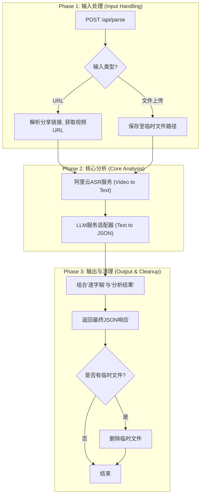

# TOM-326:dev:实现 /api/parse 核心端点以完成分析工作流

- **Status**: 🎯 Designing

---

## 1. 🎯 Design Overview
- **Objective**: 构建一个健壮、高效的后端API端点 (`/api/parse`)，作为同步阻塞服务，完整执行"视频源获取 -> ASR转录 -> LLM结构化分析"的核心工作流，支撑"客户端导航+同步API"的混合模式架构。
- **Scope**: 
  - 后端: 在FastAPI协处理器中实现`/api/parse`端点，支持URL和文件上传两种输入模式
  - 工作流: 实现视频处理、ASR转录、LLM分析的完整流程
  - 性能: 确保1分钟视频在50秒内完成端到端处理
  - 监控: 配备结构化日志和自动化告警机制，主动管理URL解析的脆弱性风险
- **Core Decisions**:
    1. **同步阻塞API设计**: 采用单一请求-响应模式，避免异步任务队列的复杂性，适配Serverless平台60秒限制
    2. **适配器模式LLM服务**: 支持DeepSeek(主)和Kimi(备)之间的配置化切换，提高服务可靠性
    3. **阿里云ASR集成**: 直接利用阿里云通义听悟处理视频源，无需本地FFmpeg转码，支持直接从视频URL进行转录
    4. **自研URL解析**: 基于PoC验证，重写抖音URL解析核心逻辑，摆脱第三方依赖，实现完全掌控

---

## 2. 🏗️ Technical Architecture
- **Tech Stack**: 
  - Backend: FastAPI 0.111+, Python 3.12+, Pydantic
  - ASR Service: 阿里云通义听悟 (Alibaba Cloud ASR)
  - LLM Services: DeepSeek API (主) + Kimi API (备)
  - Infrastructure: Docker, Nginx (反向代理)

- **Components & Data Flow**:


- **API Endpoints**:
    - `POST /api/parse`: 统一的视频解析端点
      - Content-Type: `application/json` (URL模式)
      - Content-Type: `multipart/form-data` (文件上传模式)

---

## 3. 🚀 Implementation Plan
- **Step 1: API端点基础架构** - 创建`/api/parse`路由，实现双模式输入处理（URL和文件上传），定义请求/响应模型
- **Step 2: 抖音URL解析器** - 基于PoC验证，重写DouyinParser核心逻辑，实现从分享文本到无水印视频URL的解析
- **Step 3: 阿里云ASR集成** - 集成DashScopeASR服务，实现直接从视频URL进行转录（无需本地下载）
- **Step 4: LLM服务适配器** - 实现LLMRouter和适配器，支持DeepSeek(主)和Kimi(备)的故障转移机制
- **Step 5: 监控告警系统** - 实现结构化日志和监控服务，主动管理URL解析的脆弱性风险
- **Step 6: 完整工作流集成** - 组装完整的处理流程，实现响应组装和资源清理机制
- **Step 7: 性能优化与测试** - 性能调优确保50秒内完成处理，完善错误处理和异常恢复

---

## 4. ✅ Quality & Testing
- **Code Quality**: 
  - 遵循FastAPI最佳实践和异步编程规范
  - 使用Pydantic进行严格的数据验证和序列化
  - 实现完整的错误处理和资源清理机制
  - 添加详细的Python docstrings和类型注解
  - 结构化日志记录，便于问题排查和性能监控
- **Testing Strategy**: 
  - **单元测试**: 
    - DouyinParser URL解析逻辑测试（基于真实分享链接）
    - DashScopeASR转录功能测试（Mock API响应）
    - LLMRouter故障转移机制测试
    - 各种错误场景的异常处理测试
  - **集成测试**: 
    - 完整API端点工作流测试（URL模式和文件上传模式）
    - 真实抖音链接的端到端测试
    - ASR和LLM服务的真实API集成测试
  - **性能测试**: 
    - 验证1分钟视频在50秒内完成处理的性能要求
    - 各个处理阶段的耗时分析和优化
    - 并发请求的性能表现测试
  - **脆弱性测试**: 
    - URL解析失败场景的处理测试
    - 抖音页面结构变化的适应性测试
    - 监控告警机制的有效性验证

---

## 5. 🔧 Technical Implementation Details

### 5.1 API Schema
```python
# Request Models
class VideoParseURLRequest(BaseModel):
    url: str
    
class VideoParseResponse(BaseModel):
    success: bool
    message: str
    data: Optional[Dict[str, Any]] = None  # 包含逐字稿和分析结果
    processing_time: float  # 处理耗时
    error_code: Optional[str] = None  # 错误代码

# API Endpoint
@app.post("/api/parse", response_model=VideoParseResponse)
async def parse_video(
    url: str = Form(None),
    file: UploadFile = File(None)
):
    # 处理逻辑
    pass
```

### 5.2 Service Architecture
```python
# 服务模块结构
app/
├── services/
│   ├── video_processor.py    # 视频源处理服务
│   │   ├── DouyinParser      # 抖音URL解析器
│   │   ├── FileHandler       # 文件上传处理器
│   │   └── VideoDownloader   # 视频下载器
│   ├── asr_service.py       # 阿里云ASR服务
│   │   ├── DashScopeASR     # 阿里云通义听悟集成
│   │   └── ASRResultParser  # ASR结果解析器
│   ├── llm_adapter.py       # LLM服务适配器
│   │   ├── DeepSeekAdapter  # DeepSeek API适配器
│   │   ├── KimiAdapter      # Kimi API适配器
│   │   └── LLMRouter        # LLM路由和故障转移
│   └── cleanup_service.py   # 资源清理服务
├── models/
│   ├── requests.py          # 请求模型
│   ├── responses.py         # 响应模型
│   └── video_info.py        # 视频信息模型
├── utils/
│   ├── logger.py            # 结构化日志
│   ├── monitoring.py        # 监控告警
│   └── validators.py        # 输入验证
└── main.py                  # FastAPI应用入口
```

### 5.3 核心技术实现方案

#### 5.3.1 抖音URL解析器 (基于PoC验证)
```python
class DouyinParser:
    """抖音分享链接解析器 - 基于PoC验证的自研实现"""
    
    HEADERS = {
        'User-Agent': 'Mozilla/5.0 (iPhone; CPU iPhone OS 17_2 like Mac OS X) AppleWebKit/605.1.15 (KHTML, like Gecko) EdgiOS/121.0.2277.107 Version/17.0 Mobile/15E148 Safari/604.1'
    }
    
    def parse_share_url(self, share_text: str) -> VideoInfo:
        """
        从分享文本中提取无水印视频链接
        核心原理: 网页抓取 + JSON解析 window._ROUTER_DATA
        """
        # 1. 提取分享链接
        urls = re.findall(r'http[s]?://(?:[a-zA-Z]|[0-9]|[$-_@.&+]|[!*\(\),]|(?:%[0-9a-fA-F][0-9a-fA-F]))+', share_text)
        if not urls:
            raise ValueError("未找到有效的分享链接")
        
        # 2. 获取视频ID并构造标准URL
        share_url = urls[0]
        response = requests.get(share_url, headers=self.HEADERS)
        video_id = response.url.split("?")[0].strip("/").split("/")[-1]
        canonical_url = f'https://www.iesdouyin.com/share/video/{video_id}'
        
        # 3. 解析页面JSON数据
        page_response = requests.get(canonical_url, headers=self.HEADERS)
        page_response.raise_for_status()
        
        # 4. 提取 window._ROUTER_DATA
        pattern = re.compile(r"window\._ROUTER_DATA\s*=\s*(.*?)</script>", re.DOTALL)
        match = pattern.search(page_response.text)
        if not match:
            raise ValueError("从HTML中解析视频信息失败")
        
        # 5. 解析视频信息
        json_data = json.loads(match.group(1).strip())
        video_info = self._extract_video_info(json_data, video_id)
        
        return video_info
    
    def _extract_video_info(self, json_data: dict, video_id: str) -> VideoInfo:
        """从JSON数据中提取视频信息"""
        # 支持视频和图集两种类型
        VIDEO_KEY = "video_(id)/page"
        NOTE_KEY = "note_(id)/page"
        
        if VIDEO_KEY in json_data["loaderData"]:
            video_data = json_data["loaderData"][VIDEO_KEY]["videoInfoRes"]["item_list"][0]
        elif NOTE_KEY in json_data["loaderData"]:
            video_data = json_data["loaderData"][NOTE_KEY]["videoInfoRes"]["item_list"][0]
        else:
            raise Exception("无法从JSON中解析视频或图集信息")
        
        # 获取无水印视频链接 (关键: playwm -> play)
        video_url = video_data["video"]["play_addr"]["url_list"][0].replace("playwm", "play")
        title = video_data.get("desc", "").strip() or f"douyin_{video_id}"
        
        return VideoInfo(
            video_id=video_id,
            title=self._sanitize_filename(title),
            download_url=video_url,
            duration=video_data["video"].get("duration", 0)
        )
```

#### 5.3.2 阿里云ASR服务集成
```python
class DashScopeASR:
    """阿里云通义听悟ASR服务 - 直接从视频URL转录"""
    
    def __init__(self, api_key: str, model: str = "paraformer-v2"):
        self.api_key = api_key
        self.model = model
        dashscope.api_key = api_key
    
    async def transcribe_from_url(self, video_url: str) -> str:
        """
        直接从视频URL进行转录 - 无需本地下载
        基于PoC验证: 阿里云ASR支持直接处理视频URL
        """
        try:
            # 发起异步转录任务
            task_response = dashscope.audio.asr.Transcription.async_call(
                model=self.model,
                file_urls=[video_url],
                language_hints=['zh', 'en']
            )
            
            # 等待转录完成
            transcription_response = dashscope.audio.asr.Transcription.wait(
                task=task_response.output.task_id
            )
            
            if transcription_response.status_code == HTTPStatus.OK:
                # 获取转录结果
                for transcription in transcription_response.output['results']:
                    result_url = transcription['transcription_url']
                    result = json.loads(request.urlopen(result_url).read().decode('utf8'))
                    
                    if 'transcripts' in result and len(result['transcripts']) > 0:
                        return result['transcripts'][0]['text']
                    else:
                        return "未识别到文本内容"
            else:
                raise Exception(f"转录失败: {transcription_response.output.message}")
                
        except Exception as e:
            raise Exception(f"ASR转录失败: {str(e)}")
```

#### 5.3.3 LLM服务适配器
```python
class LLMRouter:
    """LLM服务路由器 - 支持DeepSeek和Kimi的故障转移"""
    
    def __init__(self, primary_provider: str = "deepseek"):
        self.primary_provider = primary_provider
        self.adapters = {
            "deepseek": DeepSeekAdapter(),
            "kimi": KimiAdapter()
        }
    
    async def analyze_transcript(self, transcript: str) -> dict:
        """
        分析转录文本，生成三段式结构化结果
        支持主备切换的高可用设计
        """
        primary_adapter = self.adapters[self.primary_provider]
        backup_provider = "kimi" if self.primary_provider == "deepseek" else "deepseek"
        backup_adapter = self.adapters[backup_provider]
        
        try:
            # 尝试主要服务
            return await primary_adapter.analyze(transcript)
        except Exception as e:
            logger.warning(f"主要LLM服务失败，切换到备用服务: {e}")
            try:
                # 故障转移到备用服务
                return await backup_adapter.analyze(transcript)
            except Exception as backup_e:
                logger.error(f"备用LLM服务也失败: {backup_e}")
                raise Exception(f"所有LLM服务均不可用: 主服务={e}, 备用服务={backup_e}")
```

#### 5.3.4 监控告警机制
```python
class MonitoringService:
    """监控告警服务 - 主动管理URL解析脆弱性"""
    
    def __init__(self):
        self.logger = StructuredLogger("video_processor")
    
    def log_url_parsing_attempt(self, share_url: str, success: bool, error: str = None):
        """记录URL解析尝试"""
        self.logger.info("url_parsing_attempt", {
            "share_url": share_url,
            "success": success,
            "error": error,
            "timestamp": datetime.utcnow().isoformat()
        })
        
        # 失败率告警
        if not success:
            self._check_failure_rate()
    
    def _check_failure_rate(self):
        """检查失败率并触发告警"""
        # 实现失败率统计和告警逻辑
        # 当URL解析失败率超过阈值时，发送告警通知
        pass
```

### 5.4 Performance Requirements
- **端到端处理时间**: ≤50秒 (针对1分钟视频)
- **URL解析时间**: ≤3秒
- **ASR处理时间**: ≤30秒 (直接从URL转录，无需下载)
- **LLM分析时间**: ≤15秒
- **其他处理时间**: ≤2秒 (响应组装、清理等)

### 5.5 Error Handling Strategy
- **400 Bad Request**: 无效URL或文件格式，URL解析失败
- **503 Service Unavailable**: ASR服务异常
- **502 Bad Gateway**: LLM服务异常 (主备服务均失败)
- **500 Internal Server Error**: 其他系统异常
- **资源清理**: 无论成功失败都确保临时文件被删除
- **结构化日志**: 所有错误都记录详细的上下文信息，便于问题排查

---

## 6. 📋 Acceptance Criteria

基于Linear issue TOM-326的验收标准：

- [ ] **URL模式处理**: 发送包含有效抖音分享文本的URL请求，能在50秒内返回200 OK及完整分析结果
- [ ] **文件上传模式**: 通过multipart/form-data上传1分钟视频文件，能在50秒内返回200 OK及完整分析结果
- [ ] **错误处理**: 无法解析的URL返回400 Bad Request，ASR失败返回503，LLM失败返回502
- [ ] **资源清理**: 请求处理后临时视频文件被成功删除
- [ ] **响应格式**: 返回统一的JSON格式，包含逐字稿和结构化分析结果
- [ ] **性能要求**: 1分钟视频的端到端处理时间不超过50秒

---

## 7. 🌐 排除项 (Out of Scope)

- **异步任务队列**: 不包含任何形式的请求队列、后台任务或状态轮询API
- **数据库存储**: 不包含处理结果的数据库存储
- **用户认证与计费**: 不包含用户认证、授权或任何计费逻辑
- **多文件批处理**: 仅支持单个视频文件或URL的处理
---


## 8. 🔍 PoC验证总结与技术决策

### 8.1 PoC关键发现
基于对 `douyin-mcp-server` 的深度代码分析，我们验证了以下关键技术路径：

1. **URL解析可行性**: 抖音URL解析基于网页抓取 + JSON解析，核心是提取 `window._ROUTER_DATA` 对象
2. **ASR服务一致性**: 第三方工具使用的正是阿里云通义听悟 (`dashscope.audio.asr`)，与我们的技术选型完全一致
3. **直接URL转录**: 阿里云ASR支持直接从视频URL进行转录，无需本地下载和FFmpeg处理
4. **技术路径清晰**: 整个工作流程技术上完全可行，性能瓶颈主要在ASR处理时间

### 8.2 架构决策理由
- **自研 vs 依赖**: 选择重写核心逻辑而非直接依赖第三方工具，实现完全掌控
- **风险管理**: 认识到URL解析依赖页面结构的脆弱性，配备监控告警主动管理风险
- **性能优化**: 利用阿里云ASR的直接URL转录能力，避免本地下载的时间开销
- **高可用设计**: LLM服务采用主备切换，提高整体服务可靠性

### 8.3 技术风险与缓解策略
| 风险类型 | 具体风险 | 缓解策略 |
|---------|---------|---------|
| **URL解析脆弱性** | 抖音页面结构变化导致解析失败 | 结构化日志 + 失败率监控 + 自动告警 |
| **ASR服务依赖** | 阿里云服务不可用或限流 | 错误重试机制 + 降级处理 |
| **LLM服务故障** | 单一LLM服务不可用 | 主备切换 (DeepSeek + Kimi) |
| **性能瓶颈** | 处理时间超过50秒限制 | 各阶段性能监控 + 优化策略 |

### 8.4 监控指标设计
```python
# 关键监控指标
MONITORING_METRICS = {
    "url_parsing_success_rate": "URL解析成功率",
    "asr_processing_time": "ASR处理耗时",
    "llm_analysis_time": "LLM分析耗时", 
    "end_to_end_processing_time": "端到端处理时间",
    "error_rate_by_type": "按类型分类的错误率",
    "service_availability": "各服务可用性"
}
```

---

## 9. 🚨 实施注意事项

### 9.1 环境变量配置
```bash
# 必需的环境变量
DASHSCOPE_API_KEY=your_dashscope_api_key      # 阿里云通义听悟
DEEPSEEK_API_KEY=your_deepseek_api_key        # DeepSeek LLM
KIMI_API_KEY=your_kimi_api_key                # Kimi LLM (备用)
LLM_PRIMARY_PROVIDER=deepseek                 # 主要LLM服务商

# 可选配置
ASR_MODEL=paraformer-v2                       # ASR模型
MAX_PROCESSING_TIME=50                        # 最大处理时间(秒)
TEMP_DIR=/tmp/scriptparser                    # 临时文件目录
LOG_LEVEL=INFO                                # 日志级别
```

### 9.2 依赖包要求
```txt
# 新增依赖 (添加到 requirements.txt)
dashscope>=1.14.0                            # 阿里云百炼SDK
httpx>=0.24.0                                # 异步HTTP客户端
aiofiles>=23.0.0                             # 异步文件操作
python-multipart>=0.0.6                      # 文件上传支持
```

### 9.3 部署检查清单
- [ ] 环境变量正确配置
- [ ] 阿里云ASR服务账户余额充足
- [ ] DeepSeek和Kimi API密钥有效
- [ ] 临时文件目录权限正确
- [ ] 监控告警系统配置完成
- [ ] 性能测试通过50秒要求
- [ ] 错误处理机制验证完成

---

## 10. 📚 参考资料

### 10.1 相关文档
- `docs/issues/备忘录 - URL视频源提取技术可行性验证 (PoC).md` - PoC验证过程
- `docs/issues/server.py` - 参考实现代码
- `apps/coprocessor/app/main.py` - 当前FastAPI应用结构

### 10.2 API文档
- [阿里云通义听悟 API](https://help.aliyun.com/zh/dashscope/developer-reference/speech-recognition-api)
- [DeepSeek API 文档](https://platform.deepseek.com/api-docs/)
- [Kimi API 文档](https://platform.moonshot.cn/docs/)

### 10.3 技术栈
- **FastAPI**: 高性能异步Web框架
- **Pydantic**: 数据验证和序列化
- **DashScope**: 阿里云百炼SDK
- **HTTPX**: 异步HTTP客户端
- **Python 3.12+**: 现代Python特性支持