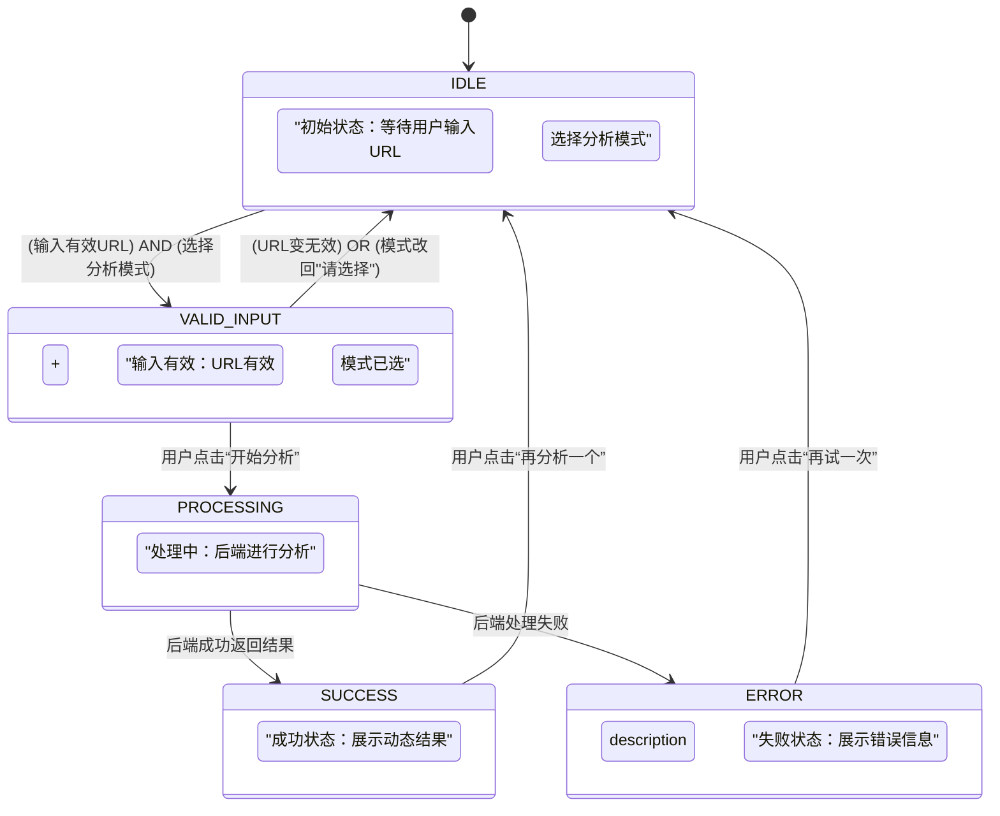

---
tags:
  - product-dev
  - prototype
  - ux-design
  - spec
  - script-parser
  - v3-mvp
status: active
version: 2.0 (V3.0 MVP版)
creation_date: 2025-09-10
last_modified_date: 2025-11-09
related_project: "[[00 - 项目驾驶舱 - 智能脚本提取器]]"
parent: "[[需求分析 - 脚本快拆(ScriptParser) MVP]]"
related:
  - "[[指南 - Rondo产品视觉风格与设计原则]]"
  - "[[备忘录 - V3.0 产品形态最终决策会]]"
aliases:
  - 原型设计 - 脚本快拆 MVP V2.0 (V3.0 MVP版)
---

# 原型设计 - 脚本快拆 MVP V2.0 (V3.0 MVP版)

> [!tip] 文档使命 (V2.0)
> 本文档是 V3.0 MVP 的**权威前端原型设计**。它在 V1.1 的基础上进行了关键升级，以匹配[[备忘录 - V3.0 产品形态最终决策会]] 中锁定的**“形态B：专业模式 - 带选择器”** 方案。
>
> 核心变更：**新增“分析模式选择器”**，并使“结果展示区” 具备动态适应**“不同赛道，不同结构”** 的能力。

## 1. 核心设计原则 (V2.0)

* **极简主义 (不变):** 移除所有不必要的UI元素，确保用户能聚焦于核心任务。
* **效率驱动 (不变):** 优化每一步交互，为用户提供最无摩擦的“用完即走”体验。
* **价值凸显 (不变):** 界面布局的核心目标是创造“原始数据”与“AI洞察”的强烈对比。
* **专业性信号 (V2.0 新增):** 主动通过“选择器” UI，向专业用户传递“我们是专业工具，而非通用玩具”的价值信号。

## 2. 整体布局与组件清单

本应用仍为单页应用。

* **核心组件清单 (V2.0 更新):**
    1.  `InputSection`: 输入区域，**已新增“分析模式选择器”**。
    2.  `ProcessingSection`: 处理中状态的反馈区域。
    3.  `ResultSection`: 成功状态的结果展示区域，**已升级为“动态结构化”**。
    4.  `ErrorSection`: 失败状态的反馈区域。

## 3. 核心交互流程 V2.0 (State Machine)

V2.0 的状态机在 `IDLE` 状态下增加了对“分析模式”的校验。

1.  **`STATE_IDLE` (初始状态):** 应用加载完成，等待用户输入URL **和** 选择分析模式。
2.  **`STATE_INPUT_VALID` (输入有效状态):** 用户输入了有效URL **且** 选择了分析模式。
3.  **`STATE_PROCESSING` (处理中状态):** 用户提交任务，后端正在处理。
4.  **`STATE_SUCCESS` (成功状态):** 后端成功返回结果。
5.  **`STATE_ERROR` (失败状态):** 用户输入无效或后端处理失败。



**流程描述:**
- 应用以 `STATE_IDLE` 开始。
- 用户输入有效URL后，进入 `STATE_INPUT_VALID`。
- 用户点击“开始分析”后，进入 `STATE_PROCESSING`。
- 处理成功后，进入 `STATE_SUCCESS`。
- 若处理失败，进入 `STATE_ERROR`。
- 在 `STATE_SUCCESS` 或 `STATE_ERROR` 中，用户可以通过“再试一次”等操作返回 `STATE_IDLE`。

## 4. 组件详解 (V2.0 更新)

### 4.1 `InputSection` 组件

- **可见状态:** `STATE_IDLE`, `STATE_INPUT_VALID`。
    
- **元素构成 (V2.0 更新):**
    
    - **`H1` 标题:**
        
        - **内容:** `脚本快拆`
            
        - **副标题 (可选 `p` 标签):** `为专业创作者打造的AI垂直洞察引擎`
            
    - **`TextInput` 输入框:**
        
        - **Placeholder 文本:** `在此处粘贴视频分享链接...`
            
        - **行为:** 实时格式校验。
            
    - **`[V2.0 新增] Select` 分析模式选择器:**
        
        - **Label (可选):** `分析模式`
            
        - **默认选项 (Disabled):** `-- 请选择一个分析模式 --`
            
        - **选项 1:** `通用叙事分析 (V2.0)`
            
        - **选项 2:** `科技产品评测 (V3.0)`
            
    - **`Button` 主要行动按钮:**
        
        - **文案:** `开始分析`
            
        - **状态 (V2.0 逻辑):**
            
            - 在 `STATE_IDLE` 时 (URL无效 或 模式未选)，**禁用 (disabled)**。
                
            - 在 `STATE_INPUT_VALID` 时 (URL有效 **且** 模式已选)，**启用 (enabled)**。
                
    - **`Link` 次要操作链接 (不变):**
        
        - **文案:** `或上传本地视频文件`
            
        - **行为:** 点击后触发文件选择器。
            

### 4.2 `ProcessingSection` 组件

- **可见状态:** `STATE_PROCESSING`。
    
- **元素构成 (V2.0 更新):**
    
    - **`Spinner` 加载动画:**
        
    - **`Paragraph` 状态文本:**
        
        - **阶段 1:** `(1/3) 正在安全上传并解析视频...`
            
        - **阶段 2 (V2.0 更新):** `(2/3) 正在调用阿里云ASR (注入"科技热词")...`
            
        - **阶段 3:** `(3/3) 正在调用LLM，进行AI结构化分析...`
            

### 4.3 `ResultSection` 组件

- **可见状态:** `STATE_SUCCESS`。
    
- **布局:** 左右分栏布局。
    
- **左栏: `TranscriptPanel` (V2.0 更新)**
    
    - **`H2` 标题:** `高精度逐字稿 (V3.0)` (提示用户这是经过热词优化的)
        
    - **`CopyButton`:**
        
    - **`ContentArea`:**
        
- **右栏: `AnalysisPanel` (V2.0 核心升级)**
    
    - **`H2` 标题:** `AI 结构化分析`
    - **`[V2.0 升级] DynamicCardRenderer` (动态卡片渲染器):**
        - **逻辑:** 此组件将**不再硬编码**“钩子、核心、CTA”。
        - 它将接收Coprocessor 返回的、**结构特化**的JSON，并动态渲染卡片。
    - **渲染逻辑示例 (伪代码):**
	    ```TypeScript
	    if (response.schema_type === 'v2_narrative') {
		  // 渲染 "V2.0 通用叙事" 卡片
		  renderCard('🚀 钩子 (Hook)', response.hook);
		  renderCard('💡 核心 (Core)', response.core);
		  renderCard('🎯 行动号召 (CTA)', response.cta);
		} 
		else if (response.schema_type === 'v3_tech_spec') {
		  // 渲染 "V3.0 科技评测" 卡片
		  renderCard('📊 产品参数', response.specs);
		  renderCard('✨ 核心卖点', response.features);
		  renderCard('💰 价格信息', response.pricing);
		  renderCard('👍 优缺点', response.pros_cons);
		}
	    ```
	- **`DownloadButton` :** `下载 Markdown (.md)`
    - **`ResetButton` :** `再分析一个`
### 4.4 `ErrorSection` 组件
- **可见状态:** `STATE_ERROR`。
- **元素构成:**
    - **`Icon` 错误图标:** 一个表示失败或警示的图标。
    - **`H2` 错误标题:**
        - **针对输入错误:** `链接格式似乎不支持`
        - **针对处理失败:** `哎呀，分析失败了`
    - **`Paragraph` 错误描述:**
        - **针对输入错误:** `请输入有效的抖音或小红书分享链接。`
        - **针对处理失败:** `可能是链接已失效或服务器暂时繁忙，请稍后再试。`
    - **`ResetButton`:**
        - **文案:** `再试一次`
        - **行为:** 点击后重置应用状态到 `STATE_IDLE`，**并自动将‘分析模式选择器’ 预设为上一次成功分析的模式。**