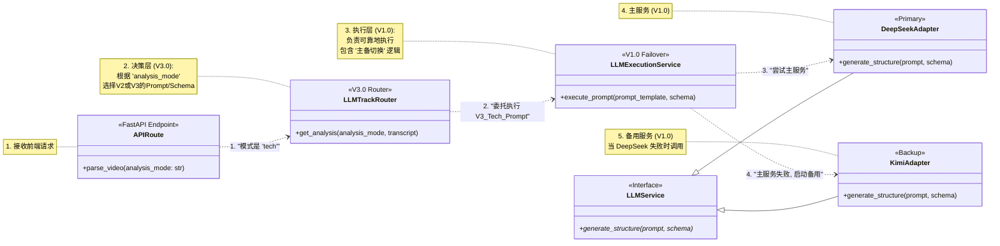

---
tags:
  - product-dev
  - architecture
  - tech-stack
  - v3-mvp
  - script-parser
  - track-router
status: active
version: 2
creation_date: 2025-11-09
last_modified_date: 2025-11-09
parent: "[[领域 - 产品研发]]"
related_project: "[[00 - 项目驾驶舱 - 智能脚本提取器]]"
related_memos:
  - "[[备忘录 - V3.0 技术规划会]]"
  - "[[备忘录 - V3.0 产品形态最终决策会]]"
parent_v1_archive: "[[技术方案 - 智能脚本提取器MVP技术选型 V1.7]]"
---

# 技术方案 - 脚本快拆-V2.0 (V3.0 MVP版)


>[!tip] 文档使命 (V2.0 - 融合版) 
>本文档是“脚本快拆” **V3.0 MVP（垂直打击版）** 的唯一权威技术选型与架构方案。
>
它的核心是基于[[备忘录 - V3.0 技术规划会]] 的决策，将V1.0的“单一任务”架构 进行了关键升维。本文档定义了一个**融合架构**：
>
>1. **功能性 (V3.0):** 正式升级为**“Coprocessor 赛道路由器” (Track Router)** 架构，以支持“形态B：专业模式” 和“不同赛道，不同结构” 的垂直打击战略。
>
>2. **可靠性 (V1.0):** **保留并集成了** V1.0 的“LLM主备切换” (Failover) 逻辑，确保新架构的健壮性。

## 1. 核心架构原则 (V2.0)

1.  **V1.0 基座复用:** V3.0的开发复用V1.0的稳定基座，包括Monorepo结构、Next.js + FastAPI技术栈、以及阿里云ASR 供应商。
2.  **V3.0 架构升维:** 本方案的核心是“升维”，而非“打补丁”。我们正式引入“赛道路由器” 和“动态热词注入” 架构，以实现“非对称”的垂直打击 能力。

## 2. 最终技术栈 (Final Tech Stack)

*本技术栈清单与V1.7保持一致，V3.0的开发不引入新的基础依赖*。

| 类别 (Category) | 技术/工具 (Technology/Tool) | 版本 (Version) | 核心用途/说明 (Core Purpose/Notes) |
| :------------ | :---------------------- | :----------- | :--------------------------- |
| **Web应用** | Node.js                 | `^20.x LTS`  | 前端应用运行时环境                    |
|               | pnpm                    | `^9.x`       | Monorepo包管理器                 |
|               | Next.js                 | `^14.2.0`    | 核心Web框架，负责UI与业务逻辑            |
|               | TypeScript              | `^5.5.0`     | 提供类型安全，提升代码健壮性               |
|               | Tailwind CSS            | `^3.4.0`     | 原子化CSS框架，用于快速构建UI            |
|               | shadcn/ui               | `^0.8.0`     | 基于`v0.dev`和Tailwind的组件集      |
| **AI协处理器** | Python                  | `^3.12`      | AI协处理器编程语言                   |
|               | FastAPI                 | `^0.111.0`   | 高性能Python API框架              |
|               | Uvicorn                 | `^0.29.0`    | ASGI服务器，用于运行FastAPI          |
| **基础设施与部署** | Docker Engine           | `^26.x`      | 应用容器化技术                      |
|               | Docker Compose          | `v3.9`       | 本地与生产环境容器编排                  |
|               | Nginx                   | `^1.27.0`    | 反向代理与流量分发                    |

## 3. 架构模型 V2.0：“Coprocessor 赛道路由器”

V1.0的“单一任务”架构 已作废。V2.0架构正式升级为“赛道路由器”，以支持“形态B：专业模式”。

### 3.1 V2.0 架构与数据流

```mermaid
graph TD
    subgraph 腾讯云服务器
        U[用户浏览器] --> N[Nginx 反向代理]
        
        N -->|携带 analysis_mode 参数| F[Web应用: Next.js 容器]
        F -->|携带 analysis_mode 参数| N
        
        N -->|/api/parse| B[AI协处理器: FastAPI 容器<br/> V2.0 赛道路由器]
        
        B -->|1 路由 analysis_mode| B
        
        B -- mode == 'tech' --> ASR_Tech[2a 调用阿里云 ASR<br/> 注入科技热词ID]
        ASR_Tech --> LLM_Tech[3a 调用 V3_Tech_Prompt]
        LLM_Tech -->|返回 科技JSON| B
        
        B -- mode == 'general' --> ASR_Gen[2b 调用阿里云 ASR<br/> 通用词库 ]
        ASR_Gen --> LLM_Gen[3b 调用 V2_Narrative_Prompt]
        LLM_Gen -->|返回 叙事JSON| B
        
        B -->|4 返回特化JSON| F
    end

````


## 4. 代码仓库目录结构 (Monorepo Structure)

_目录结构与V1.7保持不变，V3.0的开发在V1.0的目录结构内进行_。


```markdown
/script-parser/
├── apps/
│   ├── web/        # Next.js Web应用
│   │   ├── app/
│   │   ├── components/
│   │   └── package.json
│   └── coprocessor/         # FastAPI AI协处理器
│       ├── app/
│       │   ├── services/  # LLM路由、ASR服务
│       │   ├── prompts/   # <--- (V2.0 新增/重构)
│       │   │   ├── v2_narrative.prompt
│       │   │   └── v3_tech_spec.prompt
│       │   └── main.py    # 包含 /api/parse 路由
│       ├── requirements.txt
│       └── Dockerfile
... (其他配置保持不变) ...
```

## 5. LLM 服务架构 V2.0：“赛道路由器”

### 5.1 V2.0 实现蓝图 (融合版)

遵照您的指示，V2.0 架构将融合 V1.0 的“故障切换” (Failover) 可靠性设计和 V3.0 的“赛道路由” (Track Routing) 功能性需求。

这两种能力并不互斥，而是我们健壮架构的分层实现。“赛道路由器” 负责**决策（What）**，而“执行服务” 负责**执行（How）**。




**蓝图解读 (V2.0 融合版):**

1. **`APIRoute` (API接口):** 接收来自 Next.js 前端 的请求，其中包含关键的 `analysis_mode` 参数（例如 "tech" 或 "general"）。
    
2. **`LLMTrackRouter` (赛道路由器):** 这是 **V3.0 的“决策层”**。它的唯一职责是根据 `analysis_mode`，从 `prompts/` 目录加载正确的 `PromptTemplate` 和 `OutputSchema`（例如 `V3_TechSpecPrompt` 或 `V2_NarrativePrompt`）。
    
3. **`LLMExecutionService` (LLM执行服务):** 这是 **V1.0 的“可靠性层”**。它接收来自“路由器”的委托（要执行的Prompt和Schema），并负责**可靠地**完成该任务。
    
4. **`Adapters` (适配器):** `LLMExecutionService` 内部封装了 V1.0 的“主备切换”逻辑。它会**首先**尝试调用 `DeepSeekAdapter`（主服务）。如果调用失败（例如超时或API 500错误），它将捕获异常，**然后**使用完全相同的 Prompt 和 Schema **重试** `KimiAdapter`（备用服务）。

## 6. 非功能性要求 (V2.0 更新)

### 6.1 监控与日志 (V2.0)

- **要求:** AI协处理器 (FastAPI) 的结构化日志 (Structured Logging) **必须**新增以下P0级字段，以支持V3.0的调试与路由分析：
    
    - `analysis_mode` (e.g., "tech", "general")
        
    - `hotword_list_id` (注入的阿里云热词ID)
        

### 6.2 ASR API 集成 (V2.0)

- **要求:** Coprocessor 调用“阿里云通义听悟” 的服务层，必须支持**动态注入 `HotwordListID`**。
    
- **P0 实现:** P0阶段，该ID可以硬编码为我们V1的“科技词库ID”。
    
- **P1 架构:** 架构设计必须允许未来将此ID作为参数，由“赛道路由器” 动态传入。
    

### 6.3 API安全与防滥用
    
- **要求:** 必须实施**基于IP的速率限制**，以保护后端昂贵的AI服务调用。
    
- **实现:** 在 **Nginx** 层配置 `limit_req_zone` 和 `limit_req` 指令，或在 **FastAPI** 中使用中间件。初步策略为：**单个IP地址在10分钟内最多允许20次`/api/parse`调用**。
    


### 6.4 最低限度测试策略 (V2.0)

- **要求:** AI协处理器 (FastAPI) 的单元测试 范围**必须扩大**。
    
- **P0 测试范围:**
    
    - **`LLMTrackRouter` (P0 优先):** 必须覆盖“赛道路由器” 的核心逻辑：
        
        - _Test 1:_ `analysis_mode="tech"` 是否正确加载了 `V3_TechSpecPrompt`？
            
        - _Test 2:_ `analysis_mode="general"` 是否正确加载了 `V2_NarrativePrompt`？
            
        - _Test 3:_ `analysis_mode="invalid"` 是否能妥善处理错误？
            

## 7. 未来架构演进：为Agentic模式预留接口

_(与V1.7一致，V2.0架构进一步强化了此路径)_ [[技术方案 - 智能脚本提取器MVP技术选型 V1.7]]

我们V2.0的 **“Coprocessor 赛道路由器”** 架构，是向未来Agentic模式演进的**关键一步**。

目前，我们的“路由”是基于用户**显式**声明的`analysis_mode`。在V4.0（Agentic版）中，Coprocessor将进化为一个真正的Agent，它将**自主**分析视频内容，**自动**决策是应该调用“科技工具”（`V3_TechSpecPrompt`）还是“叙事工具”（`V2_NarrativePrompt`）。

V2.0架构（“形态B”） 确保了我们的工具（Prompts）是模块化、可被Agent调用的，为未来的智能化升级铺平了道路。

