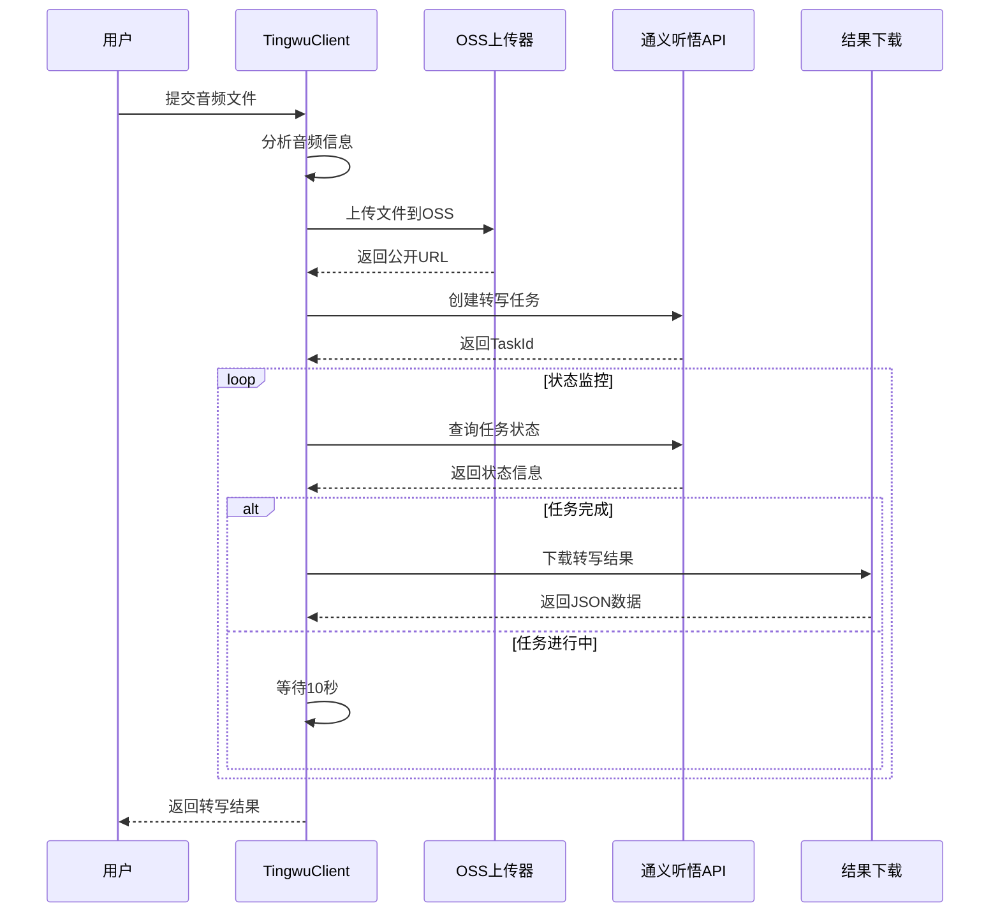
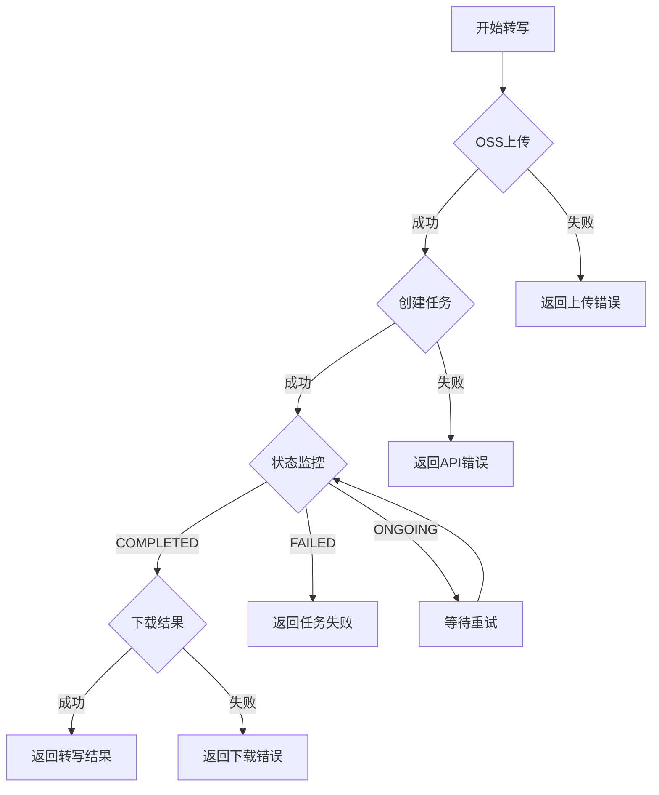

# 通义听悟ASR POC技术实现详解

## 🏗️ 整体架构设计

### 系统架构图
```
┌─────────────────────────────────────────────────────────────────┐
│                        通义听悟语音转写系统                      │
├─────────────────────────────────────────────────────────────────┤
│  用户层                                                         │
│  ┌─────────────────┐  ┌─────────────────┐  ┌─────────────────┐ │
│  │  音频文件输入   │  │  转写结果查看   │  │  文稿提取工具   │ │
│  └─────────────────┘  └─────────────────┘  └─────────────────┘ │
├─────────────────────────────────────────────────────────────────┤
│  应用层                                                         │
│  ┌─────────────────┐  ┌─────────────────┐  ┌─────────────────┐ │
│  │ TingwuClient    │  │  OSSUploader    │  │ ExtractTool     │ │
│  │ (核心控制器)    │  │  (文件上传)     │  │ (结果解析)      │ │
│  └─────────────────┘  └─────────────────┘  └─────────────────┘ │
├─────────────────────────────────────────────────────────────────┤
│  服务层                                                         │
│  ┌─────────────────┐  ┌─────────────────┐  ┌─────────────────┐ │
│  │  阿里云OSS      │  │  通义听悟API    │  │  HTTP客户端     │ │
│  │  (文件存储)     │  │  (语音转写)     │  │  (结果下载)     │ │
│  └─────────────────┘  └─────────────────┘  └─────────────────┘ │
└─────────────────────────────────────────────────────────────────┘
```

### 数据流向
```
音频文件 → OSS上传 → 通义听悟API → 状态监控 → 结果下载 → 文稿提取
    ↓         ↓          ↓          ↓          ↓          ↓
  本地文件   公开URL    任务创建    轮询状态   JSON数据   格式化文本
```

## 🔧 核心模块实现

### 1. 配置管理模块 (`config.py`)

```python
class Config:
    """配置管理类 - 统一管理所有配置项"""
    
    # 从环境变量读取配置
    ACCESS_KEY_ID = os.getenv('ALIBABA_CLOUD_ACCESS_KEY_ID')
    ACCESS_KEY_SECRET = os.getenv('ALIBABA_CLOUD_ACCESS_KEY_SECRET')
    TINGWU_APPKEY = os.getenv('ALIBABA_TINWU_APPKEY')
    
    @classmethod
    def validate(cls):
        """验证必要的配置项是否存在"""
        required_configs = [
            ('ACCESS_KEY_ID', cls.ACCESS_KEY_ID),
            ('ACCESS_KEY_SECRET', cls.ACCESS_KEY_SECRET),
            ('TINGWU_APPKEY', cls.TINGWU_APPKEY)
        ]
        
        for name, value in required_configs:
            if not value:
                raise ValueError(f"Missing required config: {name}")
```

**设计要点**：
- 集中管理所有配置项
- 环境变量优先，支持默认值
- 启动时验证必要配置
- 支持不同环境的配置切换

### 2. OSS文件上传模块 (`oss_uploader.py`)

```python
class OSSUploader:
    """OSS文件上传器 - 处理音频文件上传到阿里云OSS"""
    
    def __init__(self):
        """初始化OSS客户端和配置"""
        self.auth = oss2.Auth(access_key_id, access_key_secret)
        self.bucket_name = "tingwu-audio-poc"
        self.endpoint = f"https://oss-{region}.aliyuncs.com"
        
    def ensure_bucket_exists(self) -> bool:
        """确保bucket存在，不存在则创建"""
        try:
            self.bucket = oss2.Bucket(self.auth, self.endpoint, self.bucket_name)
            self.bucket.get_bucket_info()  # 检查bucket是否存在
            return True
        except oss2.exceptions.NoSuchBucket:
            # 创建bucket并设置公共读取权限
            self.bucket.create_bucket(oss2.BUCKET_ACL_PUBLIC_READ)
            return True
    
    def upload_file(self, local_file_path: str) -> dict:
        """上传文件到OSS并返回公开URL"""
        # 1. 生成唯一的对象键名
        timestamp = int(time.time())
        filename = os.path.basename(local_file_path)
        object_key = f"audio/{timestamp}_{filename}"
        
        # 2. 上传文件并设置公共读取权限
        result = self.bucket.put_object_from_file(
            object_key, 
            local_file_path,
            headers={'x-oss-object-acl': 'public-read'}
        )
        
        # 3. 构建公开访问URL
        file_url = f"https://{self.bucket_name}.oss-{self.region}.aliyuncs.com/{object_key}"
        
        return {
            'success': True,
            'file_url': file_url,
            'object_key': object_key,
            'etag': result.etag
        }
```

**关键技术点**：
- **自动bucket管理**: 检查并创建bucket
- **公共读取权限**: 确保通义听悟能访问文件
- **唯一文件名**: 使用时间戳避免冲突
- **错误处理**: 完善的异常处理机制

### 3. 通义听悟客户端 (`tingwu_client.py`)

#### 3.1 核心控制器

```python
class TingwuClient:
    """通义听悟客户端 - 核心业务逻辑控制器"""
    
    def __init__(self):
        """初始化阿里云SDK客户端"""
        credentials = AccessKeyCredential(access_key_id, access_key_secret)
        self.client = AcsClient(region_id=region, credential=credentials)
        
    def transcribe_audio(self, audio_file_path: str) -> dict:
        """主要业务流程 - 音频转写完整流程"""
        # 1. 音频文件分析
        audio_info = self.analyze_audio_file(audio_file_path)
        
        # 2. 尝试真实API转写
        real_result = self.try_real_transcription(audio_file_path)
        
        # 3. 处理结果并返回
        return self.process_transcription_result(real_result, audio_info)
```

#### 3.2 音频文件分析

```python
def analyze_audio_file(self, audio_file_path: str) -> dict:
    """分析音频文件获取基本信息"""
    with wave.open(audio_file_path, 'rb') as wav_file:
        frames = wav_file.getnframes()
        sample_rate = wav_file.getframerate()
        channels = wav_file.getnchannels()
        sample_width = wav_file.getsampwidth()
        duration = frames / sample_rate
        
        return {
            'duration': duration,
            'sample_rate': sample_rate,
            'channels': channels,
            'sample_width': sample_width
        }
```

#### 3.3 转写任务创建

```python
def create_transcription_task(self, file_url: str, audio_info: dict) -> dict:
    """创建通义听悟转写任务"""
    # 构建请求体
    body = {
        'AppKey': Config.TINGWU_APPKEY,
        'Input': {
            'FileUrl': file_url,
            'Format': 'wav',
            'SampleRate': audio_info['sample_rate'],
            'SourceLanguage': 'cn'
        }
    }
    
    # 创建通用请求
    request = self.create_common_request(
        domain=Config.ENDPOINT,
        version='2023-09-30',
        protocol_type='https',
        method='PUT',
        uri='/openapi/tingwu/v2/tasks'
    )
    
    # 添加查询参数和请求体
    request.add_query_param('type', 'offline')
    request.set_content(json.dumps(body).encode('utf-8'))
    
    # 发送请求
    response = self.client.do_action_with_exception(request)
    return json.loads(response)
```

#### 3.4 任务状态监控

```python
def wait_for_completion(self, task_id: str, max_wait_time: int = 300) -> dict:
    """等待任务完成 - 轮询监控机制"""
    start_time = time.time()
    check_interval = 10  # 每10秒检查一次
    
    while time.time() - start_time < max_wait_time:
        # 查询任务状态
        result = self.get_task_result(task_id)
        
        if not result['success']:
            return result
        
        status = result['response']['Data']['TaskStatus']
        
        if status in ['SUCCESS', 'COMPLETED']:
            # 任务完成，处理结果
            return self.handle_completed_task(result)
        elif status == 'FAILED':
            # 任务失败
            return self.handle_failed_task(result)
        elif status in ['ONGOING', 'PENDING', 'QUEUEING']:
            # 任务进行中，继续等待
            time.sleep(check_interval)
        else:
            # 未知状态，记录并继续等待
            print(f"Unknown status: {status}")
            time.sleep(check_interval)
    
    # 超时处理
    return {'success': False, 'error': 'Timeout waiting for completion'}
```

#### 3.5 任务结果查询

```python
def get_task_result(self, task_id: str) -> dict:
    """查询任务结果 - 按照官方API规范"""
    try:
        # 构建查询URI - 将TaskId放在路径中
        uri = f'/openapi/tingwu/v2/tasks/{task_id}'
        
        request = self.create_common_request(
            domain=Config.ENDPOINT,
            version='2023-09-30',
            protocol_type='https',
            method='GET',
            uri=uri
        )
        
        response = self.client.do_action_with_exception(request)
        response_data = json.loads(response)
        
        return {
            'success': True,
            'task_id': task_id,
            'response': response_data
        }
    except Exception as e:
        return {
            'success': False,
            'error': str(e),
            'error_type': type(e).__name__
        }
```

#### 3.6 转写结果下载

```python
def download_transcription_result(self, transcription_url: str) -> dict:
    """下载转写结果文件"""
    try:
        response = requests.get(transcription_url, timeout=30)
        response.raise_for_status()
        
        # 解析JSON结果
        result_data = response.json()
        
        return {
            'success': True,
            'data': result_data
        }
    except Exception as e:
        return {
            'success': False,
            'error': str(e)
        }
```

### 4. 文稿提取工具 (`extract_transcript.py`)

```python
def extract_full_transcript(result_file: str) -> str:
    """从转写结果中提取完整文稿"""
    
    # 1. 读取并解析JSON结果
    with open(result_file, 'r', encoding='utf-8') as f:
        data = json.load(f)
    
    raw_transcription = data['result']['raw_transcription']
    transcription = raw_transcription['Transcription']
    
    # 2. 解析段落和单词数据
    paragraphs = transcription['Paragraphs']
    sentence_details = []
    
    for para_idx, paragraph in enumerate(paragraphs, 1):
        speaker_id = paragraph.get('SpeakerId', '未知')
        words = paragraph.get('Words', [])
        
        # 按句子分组
        sentences = {}
        for word in words:
            sentence_id = word.get('SentenceId', 1)
            if sentence_id not in sentences:
                sentences[sentence_id] = []
            sentences[sentence_id].append(word)
        
        # 构建句子文本和时间戳
        for sentence_id in sorted(sentences.keys()):
            sentence_words = sentences[sentence_id]
            sentence_text = "".join([w.get('Text', '') for w in sentence_words])
            
            if sentence_text.strip():
                start_time = min([w.get('Start', 0) for w in sentence_words]) / 1000
                end_time = max([w.get('End', 0) for w in sentence_words]) / 1000
                
                sentence_details.append({
                    'paragraph': para_idx,
                    'sentence': sentence_id,
                    'speaker': speaker_id,
                    'start': start_time,
                    'end': end_time,
                    'text': sentence_text.strip()
                })
    
    # 3. 生成格式化输出
    detailed_transcript = []
    detailed_transcript.append("完整转写文稿（带时间戳）")
    detailed_transcript.append("=" * 60)
    
    for detail in sentence_details:
        time_str = f"[{detail['start']:.1f}s-{detail['end']:.1f}s]"
        speaker_str = f"说话人{detail['speaker']}" if detail['speaker'] != '1' else ""
        text_line = f"{time_str} {speaker_str} {detail['text']}"
        detailed_transcript.append(text_line.strip())
    
    # 4. 生成纯文本版本
    full_text = "\n\n".join([detail['text'] for detail in sentence_details])
    detailed_transcript.append("\n" + "=" * 60)
    detailed_transcript.append("纯文本版本")
    detailed_transcript.append("=" * 60)
    detailed_transcript.append(full_text)
    
    return "\n".join(detailed_transcript)
```

## 🔄 关键业务流程

### 1. 完整转写流程



### 2. 错误处理流程



## 🛡️ 错误处理策略

### 1. 分层错误处理

```python
# 网络层错误
try:
    response = self.client.do_action_with_exception(request)
except ClientException as e:
    return {'success': False, 'error': f'Client error: {e}'}
except ServerException as e:
    return {'success': False, 'error': f'Server error: {e}'}

# 业务层错误
if response_data.get('Code') != '0':
    return {'success': False, 'error': response_data.get('Message')}

# 数据层错误
try:
    result_data = response.json()
except json.JSONDecodeError as e:
    return {'success': False, 'error': f'Invalid JSON response: {e}'}
```

### 2. 重试机制

```python
def retry_with_backoff(func, max_retries=3, base_delay=1):
    """指数退避重试机制"""
    for attempt in range(max_retries):
        try:
            return func()
        except Exception as e:
            if attempt == max_retries - 1:
                raise e
            delay = base_delay * (2 ** attempt)
            time.sleep(delay)
```

### 3. 状态恢复

```python
def handle_task_failure(self, task_result):
    """处理任务失败情况"""
    error_code = task_result.get('ErrorCode')
    error_message = task_result.get('ErrorMessage')
    
    # 根据错误类型决定是否重试
    if error_code in ['TSC.FileError']:
        # 文件错误，不重试
        return {'success': False, 'error': 'File access error', 'retry': False}
    elif error_code in ['TSC.InternalError']:
        # 内部错误，可重试
        return {'success': False, 'error': 'Internal error', 'retry': True}
    else:
        # 未知错误，记录并不重试
        return {'success': False, 'error': f'Unknown error: {error_message}', 'retry': False}
```

## 📊 性能优化策略

### 1. 异步处理

```python
import asyncio
import aiohttp

async def async_transcribe_batch(self, audio_files):
    """批量异步转写"""
    tasks = []
    for audio_file in audio_files:
        task = asyncio.create_task(self.async_transcribe_single(audio_file))
        tasks.append(task)
    
    results = await asyncio.gather(*tasks, return_exceptions=True)
    return results
```

### 2. 结果缓存

```python
import hashlib
import pickle

def cache_result(self, audio_file_path, result):
    """缓存转写结果"""
    # 生成文件哈希作为缓存键
    with open(audio_file_path, 'rb') as f:
        file_hash = hashlib.md5(f.read()).hexdigest()
    
    cache_file = f"cache/{file_hash}.pkl"
    with open(cache_file, 'wb') as f:
        pickle.dump(result, f)

def get_cached_result(self, audio_file_path):
    """获取缓存的转写结果"""
    with open(audio_file_path, 'rb') as f:
        file_hash = hashlib.md5(f.read()).hexdigest()
    
    cache_file = f"cache/{file_hash}.pkl"
    if os.path.exists(cache_file):
        with open(cache_file, 'rb') as f:
            return pickle.load(f)
    return None
```

### 3. 连接池管理

```python
import requests
from requests.adapters import HTTPAdapter
from urllib3.util.retry import Retry

def create_http_session():
    """创建带连接池的HTTP会话"""
    session = requests.Session()
    
    # 配置重试策略
    retry_strategy = Retry(
        total=3,
        backoff_factor=1,
        status_forcelist=[429, 500, 502, 503, 504]
    )
    
    # 配置连接池
    adapter = HTTPAdapter(
        pool_connections=10,
        pool_maxsize=20,
        max_retries=retry_strategy
    )
    
    session.mount("http://", adapter)
    session.mount("https://", adapter)
    
    return session
```

## 🔒 安全考虑

### 1. 凭证管理

```python
# 使用环境变量存储敏感信息
ACCESS_KEY_ID = os.getenv('ALIBABA_CLOUD_ACCESS_KEY_ID')
ACCESS_KEY_SECRET = os.getenv('ALIBABA_CLOUD_ACCESS_KEY_SECRET')

# 避免在日志中输出敏感信息
def safe_log(message, sensitive_data=None):
    if sensitive_data:
        # 只显示前4位和后4位
        masked = sensitive_data[:4] + '*' * (len(sensitive_data) - 8) + sensitive_data[-4:]
        message = message.replace(sensitive_data, masked)
    print(message)
```

### 2. 文件权限控制

```python
def upload_with_limited_access(self, file_path):
    """上传文件并设置有限的访问权限"""
    # 设置文件过期时间
    expiration = datetime.utcnow() + timedelta(hours=24)
    
    # 上传时设置访问控制
    result = self.bucket.put_object_from_file(
        object_key,
        file_path,
        headers={
            'x-oss-object-acl': 'public-read',
            'x-oss-expires': expiration.strftime('%a, %d %b %Y %H:%M:%S GMT')
        }
    )
```

### 3. 输入验证

```python
def validate_audio_file(self, file_path):
    """验证音频文件的安全性"""
    # 检查文件大小
    file_size = os.path.getsize(file_path)
    if file_size > 100 * 1024 * 1024:  # 100MB限制
        raise ValueError("File too large")
    
    # 检查文件格式
    allowed_extensions = ['.wav', '.mp3', '.m4a', '.flac']
    file_ext = os.path.splitext(file_path)[1].lower()
    if file_ext not in allowed_extensions:
        raise ValueError(f"Unsupported file format: {file_ext}")
    
    # 检查文件头
    with open(file_path, 'rb') as f:
        header = f.read(12)
        if not (header.startswith(b'RIFF') or header.startswith(b'ID3')):
            raise ValueError("Invalid audio file format")
```

## 📈 监控和日志

### 1. 结构化日志

```python
import logging
import json

def setup_logging():
    """设置结构化日志"""
    logging.basicConfig(
        level=logging.INFO,
        format='%(asctime)s - %(name)s - %(levelname)s - %(message)s',
        handlers=[
            logging.FileHandler('tingwu.log'),
            logging.StreamHandler()
        ]
    )

def log_transcription_event(self, event_type, task_id, details=None):
    """记录转写事件"""
    log_data = {
        'event_type': event_type,
        'task_id': task_id,
        'timestamp': datetime.utcnow().isoformat(),
        'details': details or {}
    }
    
    logging.info(json.dumps(log_data, ensure_ascii=False))
```

### 2. 性能监控

```python
import time
from functools import wraps

def monitor_performance(func):
    """性能监控装饰器"""
    @wraps(func)
    def wrapper(*args, **kwargs):
        start_time = time.time()
        try:
            result = func(*args, **kwargs)
            success = True
        except Exception as e:
            result = None
            success = False
            raise
        finally:
            end_time = time.time()
            duration = end_time - start_time
            
            # 记录性能指标
            log_performance_metric(
                function_name=func.__name__,
                duration=duration,
                success=success
            )
        
        return result
    return wrapper
```

### 3. 健康检查

```python
def health_check(self):
    """系统健康检查"""
    checks = {
        'oss_connection': self.check_oss_connection(),
        'tingwu_api': self.check_tingwu_api(),
        'disk_space': self.check_disk_space(),
        'memory_usage': self.check_memory_usage()
    }
    
    all_healthy = all(checks.values())
    
    return {
        'healthy': all_healthy,
        'checks': checks,
        'timestamp': datetime.utcnow().isoformat()
    }
```

## 🚀 部署和扩展

### 1. Docker化部署

```dockerfile
FROM python:3.12-slim

WORKDIR /app

COPY requirements.txt .
RUN pip install -r requirements.txt

COPY src/ ./src/
COPY examples/ ./examples/

ENV PYTHONPATH=/app/src

CMD ["python", "src/tingwu_client.py"]
```

### 2. 微服务架构

```python
from flask import Flask, request, jsonify
from celery import Celery

app = Flask(__name__)
celery = Celery('tingwu_service')

@app.route('/transcribe', methods=['POST'])
def transcribe_endpoint():
    """转写服务API端点"""
    file = request.files['audio']
    
    # 异步处理
    task = transcribe_task.delay(file.filename)
    
    return jsonify({
        'task_id': task.id,
        'status': 'processing'
    })

@celery.task
def transcribe_task(file_path):
    """异步转写任务"""
    client = TingwuClient()
    result = client.transcribe_audio(file_path)
    return result
```

### 3. 水平扩展

```python
class TingwuCluster:
    """通义听悟集群管理"""
    
    def __init__(self, nodes):
        self.nodes = nodes
        self.current_node = 0
    
    def get_next_node(self):
        """负载均衡 - 轮询算法"""
        node = self.nodes[self.current_node]
        self.current_node = (self.current_node + 1) % len(self.nodes)
        return node
    
    def transcribe_with_failover(self, audio_file):
        """带故障转移的转写"""
        for node in self.nodes:
            try:
                return node.transcribe_audio(audio_file)
            except Exception as e:
                logging.warning(f"Node {node} failed: {e}")
                continue
        
        raise Exception("All nodes failed")
```

---

**📝 总结**: 本技术实现文档详细描述了通义听悟POC的完整技术架构、核心模块实现、关键业务流程、错误处理策略、性能优化方案、安全考虑、监控日志以及部署扩展方案，为生产环境集成提供了完整的技术参考。